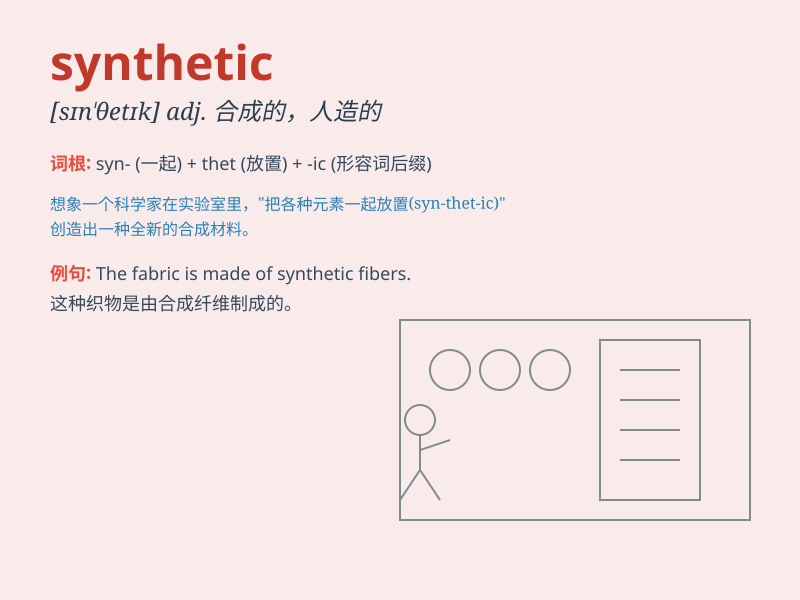

## synthetic

**英音:** _[sɪn\'θetɪk]_ **美音:** _[sɪn\'θɛtɪk]_

**译义:** *adj.合成的,人造的,综合的*

### 短语

+ **synthetic fiber:** _合成纤维_

+ **synthetic material:** _合成材料_

+ **synthetic rubber:** _合成橡胶_

+ **synthetic language:** _综合语_

+ **synthetic detergent:** _合成洗涤剂_

### 例句

#### 例句1

> **This fabric is synthetic and not very breathable.**

**中文翻译:** 这种布料是合成的，透气性不是很好。

**单词释义:** 合成的；人造的

#### 例句2

> **The chemist is working on a new synthetic compound.**

**中文翻译:** 这位化学家正在研究一种新的合成化合物。

**单词释义:** 合成的

#### 例句3

> **Synthetic materials are often used in modern manufacturing.**

**中文翻译:** 合成材料在现代制造业中经常被使用。

**单词释义:** 合成的；人造的

### 背诵小故事

> A scientist was working in the lab, trying to create a new material.
After many attempts, he finally made a synthetic substance that was
stronger and more useful than natural ones. This synthetic material
changed the way we build things.

**一位科学家在实验室工作，试图创造一种新材料。经过多次尝试，他最终制成了一种比天然材料更强更有用的合成物质。这种合成材料改变了我们建造东西的方式。**

### 图义

