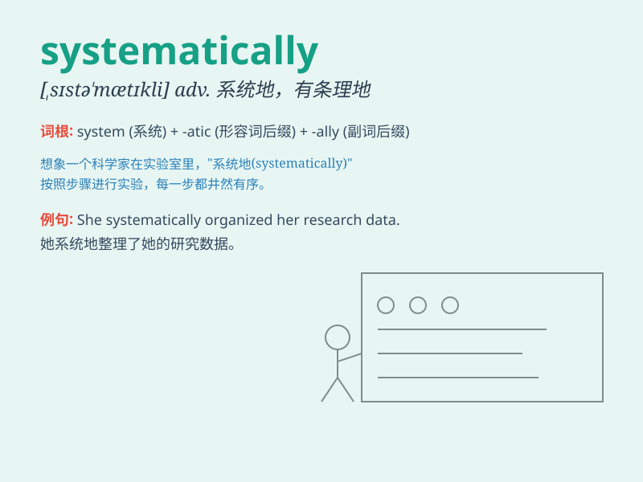

## systematically

**英音:** _[,sɪstə\'mætɪklɪ]_ **美音:**
_[,sɪstə\'mætɪkl]_

**译义:** *adv.系统地,有系统地*

### 短语

+ **systematically analyze:** _系统地分析_

+ **systematically investigate:** _系统地调查_

+ **systematically organize:** _系统地组织_

+ **systematically approach:** _系统地处理_

+ **systematically study:** _系统地研究_

### 例句

#### 例句1

> **The company has been systematically expanding its market
share.**

**中文翻译:** 这家公司一直在有系统地扩大其市场份额。

**单词释义:** 有系统地；有条不紊地

#### 例句2

> **They have systematically analyzed the data to draw
conclusions.**

**中文翻译:** 他们系统地分析了数据以得出结论。

**单词释义:** 系统地

#### 例句3

> **The team systematically approached the problem and found a
solution.**

**中文翻译:** 团队有条不紊地处理这个问题并找到了一个解决方案。

**单词释义:** 有条不紊地

### 背诵小故事

> A detective was investigating a crime systematically. He checked
every clue, followed every lead, and organized all the information
neatly. This way, he could solve the mystery step by step.

**一位侦探正在系统地调查一起犯罪案件。他检查每一条线索，追踪每一个头绪，并将所有信息整齐地整理好。这样，他就能一步一步地解开谜团。**

### 图义

