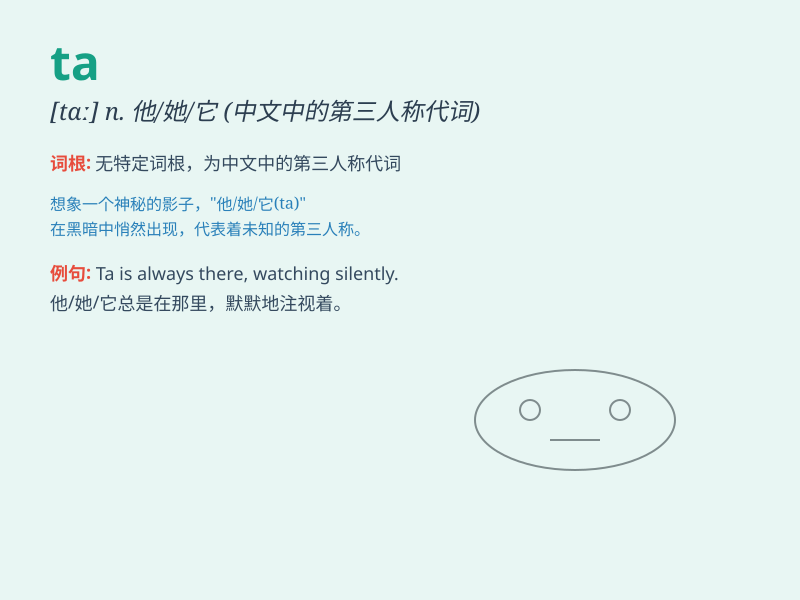

## ta

**英音:** _[ˌtiː ˈeɪ]_ **美音:** _[ˌtiː ˈeɪ]_

**译义:** * [军] Top Attack,顶部攻击 teaching assistant,助教 symb
[化]钽 Ta(tantalum)*

### 短语

+ **ta very much:** _非常感谢_

+ **ta for now:** _再见_

+ **ta ta:** _再见_

+ **say ta:** _道别_

+ **cheers ta:** _谢谢_

### 例句

#### 例句1

> **Ta is very kind.**

**中文翻译:** 他/她非常善良。

**单词释义:** 他/她（非正式用法）

#### 例句2

> **Thank you, ta.**

**中文翻译:** 谢谢你，他/她。

**单词释义:** 他/她（表示感谢的对象）

#### 例句3

> **Ta has a beautiful smile.**

**中文翻译:** 他/她有一个美丽的笑容。

**单词释义:** 他/她

### 背诵小故事

> Ta
是一个神秘的声音，想象在一个黑暗的森林中，你迷路了，突然听到一个轻柔的
\'Ta\' ，仿佛是精灵在指引你方向。Ta 这个声音，简单却充满魔力。

**Ta
是一个简单的发音，这个故事通过神秘的场景将其与指引联系起来，帮助记忆。**

### 图义

