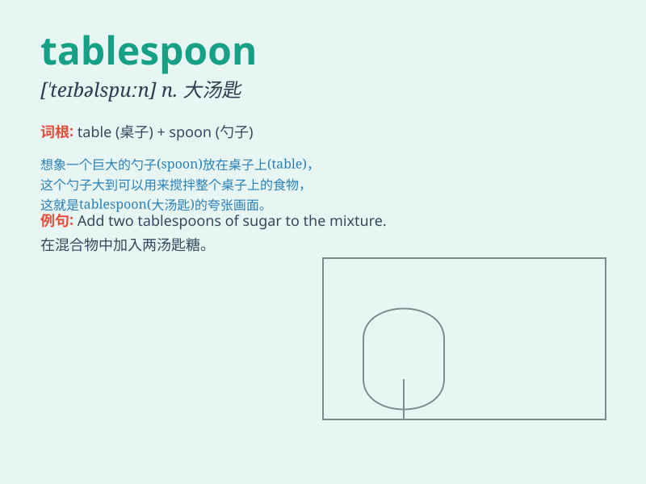

## tablespoon

**英音:** _[ˈteɪblspuːn]_ **美音:** _[ˈteɪblspuːn]_

**译义:** *n.大汤匙*

### 短语

+ **tablespoonful:** _一汤匙的量_

+ **tablespoon measure:** _汤匙量具_

+ **tablespoon of sugar:** _一汤匙糖_

+ **tablespoon of oil:** _一汤匙油_

+ **tablespoon of salt:** _一汤匙盐_

### 例句

#### 例句1

> **Add two tablespoons of sugar to the mixture.**

**中文翻译:** 向混合物中加入两勺糖。

**单词释义:** 大汤匙（容量单位）

#### 例句2

> **She measured out a tablespoon of medicine.**

**中文翻译:** 她量出了一汤匙的药。

**单词释义:** 大汤匙（用作量具）

#### 例句3

> **You need to use one tablespoon of salt for this recipe.**

**中文翻译:** 这个食谱你需要用一汤匙盐。

**单词释义:** 大汤匙（表示量）

### 背诵小故事

> One day, I was cooking and needed to measure an ingredient. I reached
for the tablespoon and thought, \'This big spoon is like a hero, saving
my dish with precise measurements every time!\'

**有一天，我在做饭，需要测量一种配料。我伸手去拿大汤匙，心想：'这把大汤匙就像个英雄，每次都能精确测量，拯救我的菜肴！'**

### 图义

