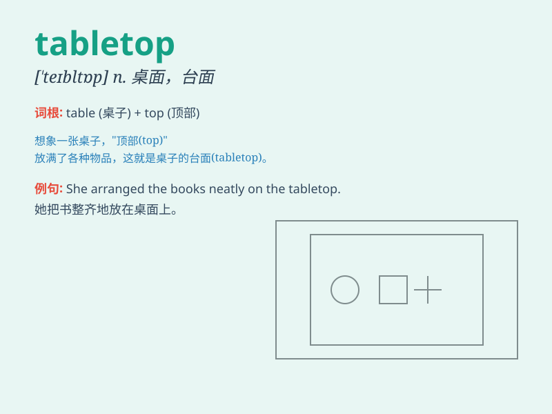

## tabletop

**英音:** _[\'teɪbltɒp]_ **美音:** _[\'tebltɑp]_

**译义:** *n.桌面*

### 短语

+ **tabletop game:** _桌面游戏_

+ **tabletop display:** _桌面展示_

+ **tabletop surface:** _桌面表面_

+ **tabletop model:** _桌面模型_

+ **tabletop decoration:** _桌面装饰_

### 例句

#### 例句1

> **The tabletop was made of solid wood.**

**中文翻译:** 桌面是由实木制成的。

**单词释义:** 桌面

#### 例句2

> **She placed a vase of flowers on the tabletop.**

**中文翻译:** 她在桌面上放了一瓶花。

**单词释义:** 桌面

#### 例句3

> **The tabletop was covered with a clean cloth for the dinner
party.**

**中文翻译:** 为了晚宴，桌面铺上了一块干净的布。

**单词释义:** 桌面

### 背诵小故事

> One day, I was looking for a place to do my homework. I found a nice
tabletop in the garden. It was smooth and clean, just perfect for me to
lay my books and start studying.

**有一天，我正在找地方写作业。我在花园里发现了一个漂亮的桌面。它又光滑又干净，对我来说正好可以摊开书本开始学习。**

### 图义

