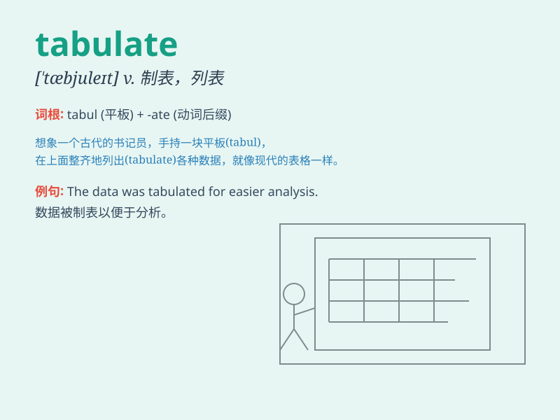

## tabulate

**英音:** _[\'tæbjʊleɪt]_ **美音:** _[\'tæbjulet]_

**译义:** *vt.把\...制成表格v.列表*

### 短语

+ **tabulate data:** _将数据制成表格_

+ **tabulate results:** _将结果列表_

+ **tabulate figures:** _将数字制成表格_

+ **tabulate expenses:** _列出费用_

+ **tabulate scores:** _将分数列表_

### 例句

#### 例句1

> **The data was carefully tabulated to show the trends.**

**中文翻译:** 数据被仔细地制成表格以展示趋势。

**单词释义:** 制成表格；列表

#### 例句2

> **He spent hours tabulating the results of the survey.**

**中文翻译:** 他花了几个小时把调查结果制成表格。

**单词释义:** 把......制成表格

#### 例句3

> **The accountant was responsible for tabulating the company\'s
expenses.**

**中文翻译:** 会计负责把公司的开支制成表格。

**单词释义:** 列表；制成表格

### 背诵小故事

>
想象一下，一位科学家在实验室里，将实验数据整齐地排列在表格（tabulate）中，就像士兵在操场上整齐列队一样。这样就能记住
tabulate 有'把...制成表格；列表显示'的意思啦。

**想象一位科学家将实验数据制成表格来记住 tabulate
表示'把...制成表格；列表显示'的意思**

### 图义

