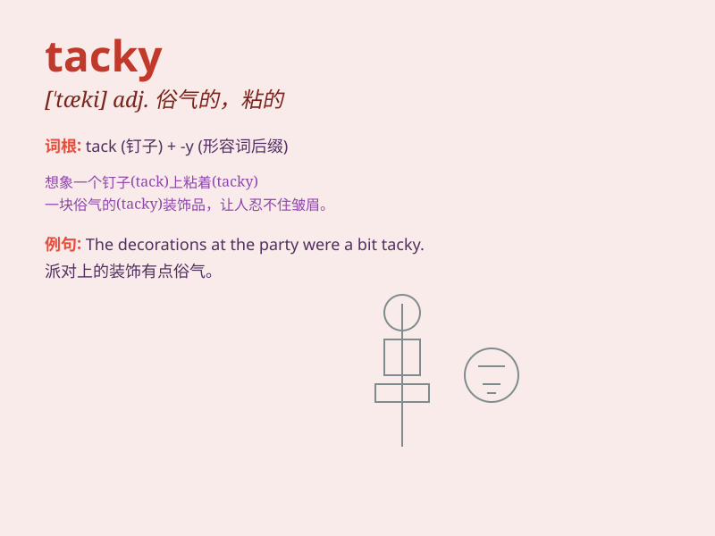

## tacky

**英音:** _[\'tækɪ]_ **美音:** _[\'tæki]_

**译义:** *adj.有些粘的,缺乏教养或风度的,俗气的*

### 短语

+ **tacky glue:** _粘性胶水_

+ **tacky clothes:** _俗气的衣服_

+ **tacky taste:** _低级的品味_

+ **tacky surface:** _发粘的表面_

+ **tacky behavior:** _粗俗的行为_

### 例句

#### 例句1

> **The paint on the wall looks tacky.**

**中文翻译:** 墙上的油漆看起来很俗气。

**单词释义:** 俗气的；蹩脚的

#### 例句2

> **Her dress was made of a tacky fabric.**

**中文翻译:** 她的连衣裙是用一种劣质的布料做的。

**单词释义:** 劣质的；质量差的

#### 例句3

> **The party decorations were a bit tacky.**

**中文翻译:** 派对的装饰有点俗丽。

**单词释义:** 俗丽的；花哨而不雅的

### 背诵小故事

> A girl wore a tacky dress to the party. It was covered in shiny
sequins and had a strange color combination. Everyone noticed how bad it
looked. So, tacky means lacking style or good taste.

**一个女孩穿着一件俗气的裙子去参加聚会。它满是闪亮的亮片，颜色搭配也很奇怪。每个人都注意到它看起来有多糟糕。所以，tacky
意思是缺乏风格或好品味。**

### 图义

