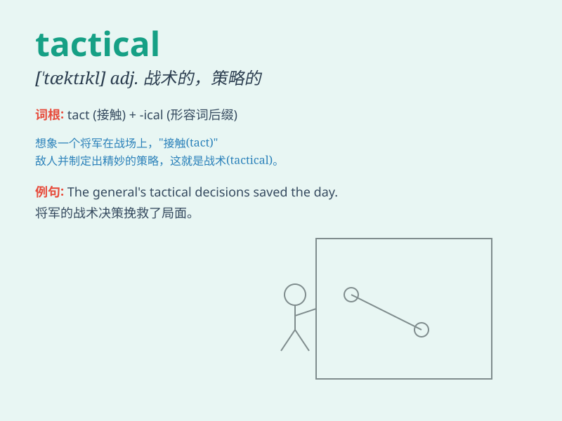

## tactical

**英音:** _[\'tæktɪk(ə)l]_ **美音:** _[\'tæktɪkl]_

**译义:** *adj.战术的*

### 短语

+ **tactical advantage:** _战术优势_

+ **tactical decision:** _战术决策_

+ **tactical move:** _战术行动_

+ **tactical planning:** _战术规划_

+ **tactical support:** _战术支持_

### 例句

#### 例句1

> **The general devised a tactical plan to win the battle.**

**中文翻译:** 这位将军制定了一个战术计划来赢得这场战斗。

**单词释义:** 战术上的；策略性的

#### 例句2

> **The team made some tactical substitutions during the game.**

**中文翻译:** 在比赛中，这个团队做了一些战术上的人员替换。

**单词释义:** 战术的；策略的

#### 例句3

> **His tactical move caught the opponent off guard.**

**中文翻译:** 他的策略性行动让对手措手不及。

**单词释义:** 策略性的；有策略的

### 背诵小故事

> A soldier was in a crucial battle. To win, he needed to be tactical.
He carefully planned each move, using smart strategies. His tactical
thinking led the team to victory. Remember, \'tactical\' means related
to tactics and careful planning.

**一名士兵身处关键战役中。为了获胜，他需要有策略。他仔细规划每一步行动，运用聪明的战略。他的策略性思维带领团队走向胜利。记住，\'tactical\'意思是与策略和精心规划有关。**

### 图义

