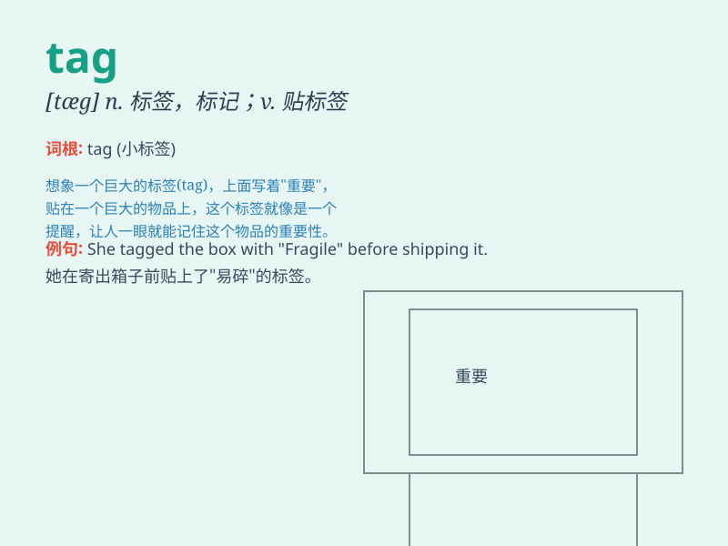

## tag

**英音:** _[tæg]_ **美音:** _[tæɡ]_

**译义:**
*n.标签,鞋带、绳子等末端的金属物,垂下物,附属物,名称,标记符,陈词滥调,结束语vt.加标签于,紧随,添饰,起浑名,连接vi.紧随*

### 短语

+ **price tag:** _价格标签_

+ **tag along:** _跟随，尾随_

+ **name tag:** _姓名标签_

+ **tag question:** _附加疑问句_

+ **tag team:** _（职业摔跤中的）双人组合_

### 例句

#### 例句1

> **She tagged her luggage before boarding the plane.**

**中文翻译:** 在登机前，她给她的行李贴上了标签。

**单词释义:** 给...加上标签

#### 例句2

> **The kids were playing tag in the park.**

**中文翻译:** 孩子们在公园里玩捉人游戏。

**单词释义:** 捉人游戏

#### 例句3

> **The price tag on the dress was too high.**

**中文翻译:** 这件连衣裙的价格标签太高了。

**单词释义:** 价格标签

### 背诵小故事

> One day, Tom was playing a game. To identify each other, they wore
tags on their clothes. The tags had their names on them. So, \'tag\'
means a label or a mark.

**一天，汤姆在玩游戏。为了互相识别，他们在衣服上戴着标签。标签上有他们的名字。所以，\'tag\'意思是标签或标记。**

### 图义

