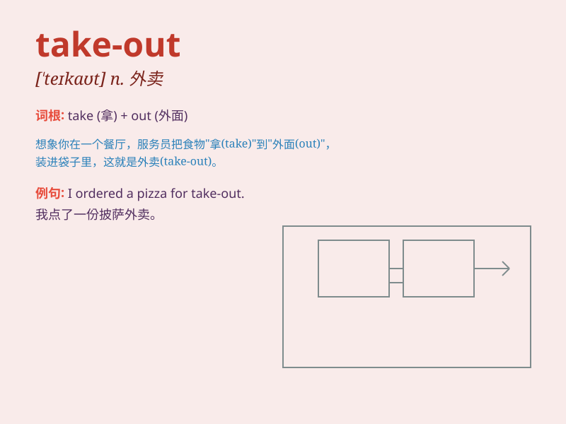

## take-out

**英音:** _[ˈteɪkaʊt]_ **美音:** _[ˈteɪkaʊt]_

**译义:** *n.外卖食品；外卖餐馆；外卖餐；外卖店*

### 短语

+ **take-out food:** _外卖食品_

+ **take-out menu:** _外卖菜单_

+ **take-out service:** _外卖服务_

+ **order take-out:** _点外卖_

+ **provide take-out:** _提供外卖_

### 例句

#### 例句1

> **I ordered some take-out food for dinner.**

**中文翻译:** 我为晚餐点了一些外卖食品。

**单词释义:** 外卖食品

#### 例句2

> **The take-out from that restaurant is always delicious.**

**中文翻译:** 那家餐厅的外卖总是很美味。

**单词释义:** 外卖

#### 例句3

> **Let\'s get take-out instead of cooking at home.**

**中文翻译:** 我们叫外卖吧，别在家做饭了。

**单词释义:** 外卖

### 背诵小故事

> One day, I was too tired to cook. So, I decided to have a take-out. I
called the restaurant and soon, a delivery person brought the delicious
food to my door. It was so convenient!

**有一天，我太累了不想做饭。所以，我决定点外卖。我给餐厅打电话，很快，一个送餐员就把美味的食物送到了我家门口。真是太方便了！**

### 图义

