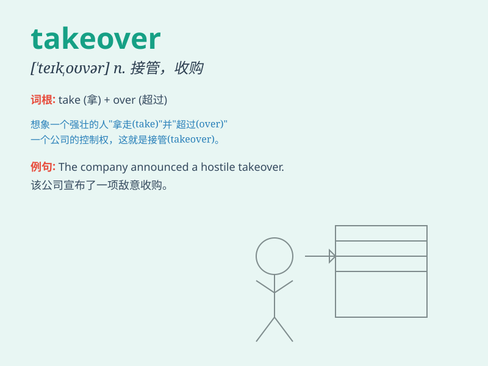

## takeover

**英音:** _[ˈteɪkˌoʊvə]_ **美音:** _[ˈteɪkoʊvər]_

**译义:** *n. 接管，接收；收购；（尤指突然）接任*

### 短语

+ **hostile takeover:** _恶意收购_

+ **takeover bid:** _收购出价；收购投标_

+ **corporate takeover:** _公司收购_

+ **takeover offer:** _收购要约_

+ **leveraged takeover:** _杠杆收购_

### 例句

#### 例句1

> **The company is planning a takeover of its smaller rival.**

**中文翻译:** 这家公司正计划收购其较小的竞争对手。

**单词释义:** 收购；接管

#### 例句2

> **The military takeover was met with widespread opposition.**

**中文翻译:** 军事接管遭到了广泛的反对。

**单词释义:** 接管；控制

#### 例句3

> **The new management team carried out a smooth takeover of the
business.**

**中文翻译:** 新的管理团队顺利地完成了对业务的接管。

**单词释义:** 接管；接收

### 背诵小故事

> 想象一个小公司面临困境，这时一家大公司出现，就像英雄一样。大公司'take
over'了小公司，带来新的管理和资源，让小公司重新焕发生机。意思就是接管、收购。

**想象一家大公司接管、收购面临困境的小公司，并带来新变化。解释为接管、收购。**

### 图义

