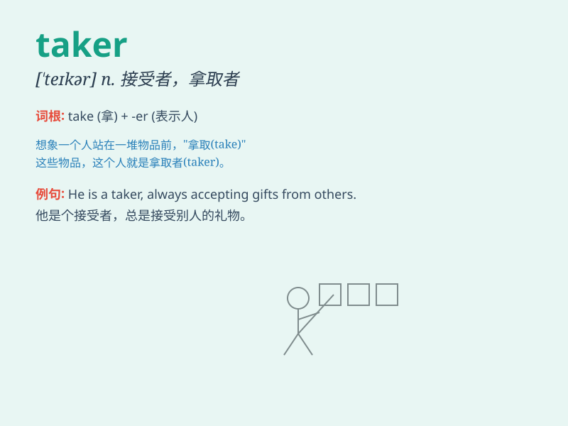

## taker

**英音:** _[ˈteɪkə(r)]_ **美音:** _[ˈteɪkər]_

**译义:** *n.接受者；收取者； taker 常用在复合词中，如
risk-taker（冒险者）*

### 短语

+ **risk taker:** _敢于冒险的人_

+ **order taker:** _订单接受者_

+ **loan taker:** _贷款接受者_

+ **job taker:** _接受工作的人_

+ **bet taker:** _接受赌注的人_

### 例句

#### 例句1

> **She\'s a risk taker and always up for new adventures.**

**中文翻译:** 她是个敢于冒险的人，总是准备迎接新的冒险。

**单词释义:** 敢于冒险的人

#### 例句2

> **The job taker was very qualified for the position.**

**中文翻译:** 这位求职者非常符合这个职位的要求。

**单词释义:** 求职者

#### 例句3

> **He\'s a heavy coffee taker and drinks several cups a day.**

**中文翻译:** 他是个咖啡消耗量大的人，每天喝好几杯。

**单词释义:** 大量消耗......的人

### 背诵小故事

> A thief was always a taker. He took people\'s money and never gave
back. One day, he was caught and realized that being a taker was wrong.
From then on, he decided to change and become a giver.

**一个小偷总是索取者。他拿走人们的钱且从不归还。有一天，他被抓住了，并意识到做一个索取者是错误的。从那以后，他决定改变，成为一个给予者。**

### 图义

