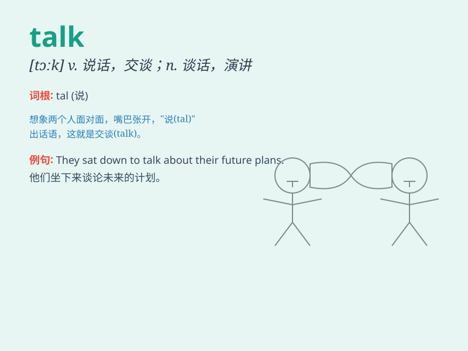

## talk

**英音:** _[tɔːk]_ **美音:** _[tɔk]_

**译义:**
*v.谈话,讲,谈论,议论,说服某人做某事n.谈话,会谈,讲演,讲话*

### 短语

+ **talk about:** _谈论；讨论_

+ **talk to:** _与\...\...交谈_

+ **talk with:** _与\...\...交谈_

+ **talk of:** _谈到；说起_

+ **talk back:** _顶嘴；回嘴_

### 例句

#### 例句1

> **They had a long talk about their future plans.**

**中文翻译:** 他们就未来的计划进行了长时间的交谈。

**单词释义:** 交谈；谈话

#### 例句2

> **Don\'t talk nonsense!**

**中文翻译:** 别胡说八道！

**单词释义:** 说话；讲话

#### 例句3

> **She talks to her plants as if they were her friends.**

**中文翻译:** 她跟她的植物说话，就好像它们是她的朋友一样。

**单词释义:** 说话；交流

### 背诵小故事

> One day, Tom and Jerry had a talk. They sat in the garden, sharing
their thoughts and feelings. Tom talked about his new toy, and Jerry
talked about his adventure. It was a nice and friendly talk.

**有一天，汤姆和杰瑞进行了一次谈话。他们坐在花园里，分享着各自的想法和感受。汤姆谈论了他的新玩具，杰瑞谈论了他的冒险经历。这是一次美好而友好的交谈。**

### 图义

