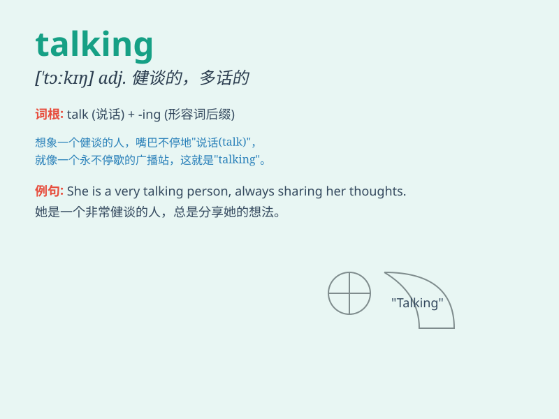

## talking

**英音:** _[\'tɔːkɪŋ]_ **美音:** _[\'tɔkɪŋ]_

**译义:** *adj.说话的,表情丰富的n.谈论*

### 短语

+ **talking point:** _话题；论点_

+ **talking of:** _谈到；说起_

+ **talking shop:** _清谈俱乐部；只说不做的空谈会_

+ **stop talking:** _停止讲话_

+ **keep talking:** _继续说_

### 例句

#### 例句1

> **They were talking loudly in the library.**

**中文翻译:** 他们在图书馆里大声交谈。

**单词释义:** 交谈，说话

#### 例句2

> **Stop talking and start working.**

**中文翻译:** 别说话了，开始工作。

**单词释义:** 说话

#### 例句3

> **I heard them talking about the party.**

**中文翻译:** 我听到他们在谈论那个聚会。

**单词释义:** 谈论

### 背诵小故事

> One day, I was in a park and saw two birds on a branch, constantly
talking to each other. It seemed they were sharing secrets of the
forest. The way they were talking was so lively and interesting.

**有一天，我在公园看到两只鸟在树枝上，不停地相互交谈。它们似乎在分享森林的秘密。它们交谈的方式是如此生动有趣。**

### 图义

