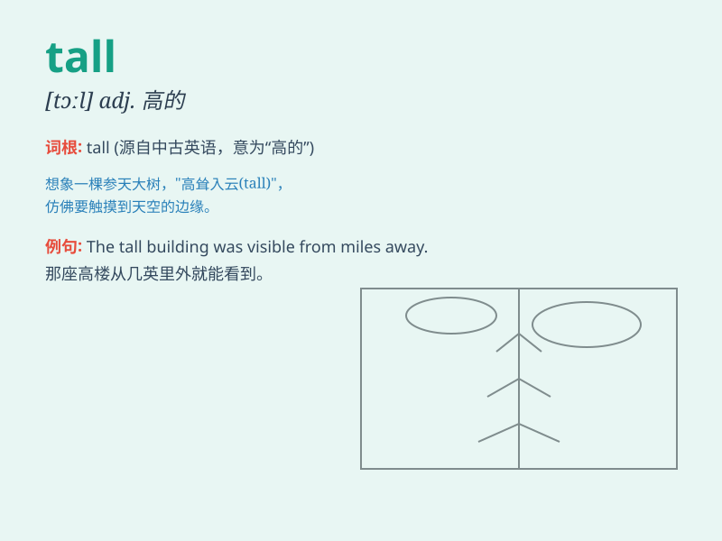

## tall

**英音:** _[tɔːl]_ **美音:** _[tɔl]_

**译义:** *adj.高的,长的,夸大的adv.\<俚> 夸大地*

### 短语

+ **tall building:** _高楼_

+ **tall tree:** _高大的树_

+ **tall order:** _难以完成的任务；过高的要求_

+ **tall story:** _难以置信的故事；夸张的叙述_

+ **tall grass:** _高草_

### 例句

#### 例句1

> **He is a tall man.**

**中文翻译:** 他是个高个子男人。

**单词释义:** 高的（形容人的身高）

#### 例句2

> **The tall building stands in the center of the city.**

**中文翻译:** 这座高楼矗立在市中心。

**单词释义:** 高的（形容建筑物的高度）

#### 例句3

> **She grows tall very quickly.**

**中文翻译:** 她长得很快，个子很高。

**单词释义:** 高的（形容人的成长状态）

### 背诵小故事

> One day, a little monkey wanted to pick bananas from a tall tree. But
it was too short to reach. Then a tall giraffe came and easily got the
bananas for the monkey. The little monkey was very happy.

**一天，一只小猴子想从一棵高大的树上摘香蕉。但它太矮够不着。然后一只高大的长颈鹿来了，轻松地为猴子摘到了香蕉。小猴子非常高兴。**

### 图义

