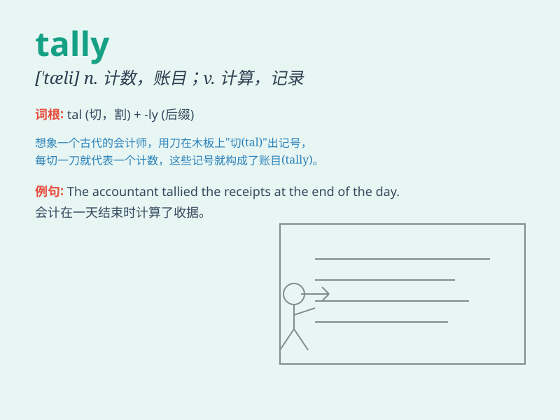

## tally

**英音:** _[\'tælɪ]_ **美音:** _[\'tæli]_

**译义:**
*n.符木(古时用,上有刻痕记载交货、欠款等的数量),记账,得分,标记牌,标签,符合,对应物,计数器vt.点数,计算,记录,加标签于,使符合vi.符合,吻合,记分*

### 短语

+ **keep tally:** _保持记录_

+ **tally sheet:** _计数表；理货单_

+ **tally with:** _与\...\...相符；与\...\...一致_

+ **mental tally:** _心里记数_

+ **tally mark:** _记数符号_

### 例句

#### 例句1

> **The votes were tallied and the results announced.**

**中文翻译:** 选票被统计，结果被公布。

**单词释义:** 统计

#### 例句2

> **Her expenses do not tally with her income.**

**中文翻译:** 她的支出与收入不符。

**单词释义:** 符合；与\...一致

#### 例句3

> **The two accounts of the accident do not tally.**

**中文翻译:** 关于那次事故的两种说法不一致。

**单词释义:** 一致；相符

### 背诵小故事

> A king was counting his treasures. Every time he added a new one, he
made a tally mark. One mark for one treasure. Finally, he knew exactly
how many he had. The tally marks helped him keep track.

**一位国王在数他的财宝。每次新增一件，他就做一个 tally
标记。一个标记代表一件财宝。最后，他确切地知道自己有多少财宝。这些 tally
标记帮助他进行记录。**

### 图义

