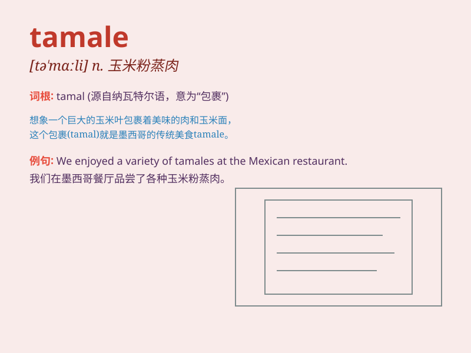

## tamale

**英音:** _[tə\'mɑːleɪ; -\'mɑːlɪ]_ **美音:**
_[tə\'mɑli]_

**译义:** *n.墨西哥烹调的一种*

### 短语

+ **make tamales:** _制作玉米粉蒸肉_

+ **eat tamales:** _吃玉米粉蒸肉_

+ **tamale pie:** _玉米粉蒸肉馅饼_

+ **sweet tamales:** _甜玉米粉蒸肉_

+ **spicy tamales:** _辣玉米粉蒸肉_

### 例句

#### 例句1

> **I love the taste of tamales, especially during the holiday
season.**

**中文翻译:** 我喜欢玉米粉蒸肉的味道，尤其是在节日期间。

**单词释义:** 玉米粉蒸肉（一种墨西哥食品）

#### 例句2

> **She learned how to make tamales from her grandmother.**

**中文翻译:** 她从她祖母那里学会了如何制作玉米粉蒸肉。

**单词释义:** 玉米粉蒸肉（一种墨西哥食品）

#### 例句3

> **The local market sells various kinds of tamales.**

**中文翻译:** 当地市场出售各种各样的玉米粉蒸肉。

**单词释义:** 玉米粉蒸肉（一种墨西哥食品）

### 背诵小故事

> One day, Tom was very hungry. He went to a market and found a special
food called \'tamale\'. It was wrapped in corn husks and smelled
delicious. Tom ate it and felt very satisfied.

**有一天，汤姆非常饿。他去了一个市场，发现了一种叫做'tamale'的特别食物。它用玉米壳包裹着，闻起来很香。汤姆吃了它，感到非常满足。**

### 图义

