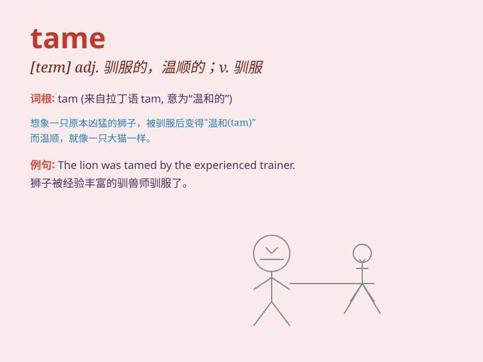

## tame

**英音:** _[teɪm]_ **美音:** _[teɪm]_

**译义:**
*adj.(指动物)驯服的、柔顺的,(指人)没精打彩的、顺从的,被开垦的,沉闷的,乏味的,平淡的vt.驯养,驯服,制服,使变得平淡vi.变得驯服*

### 短语

+ **tame animals:** _驯服的动物_

+ **tame nature:** _征服自然_

+ **tame landscape:** _开垦的景观_

+ **tame hair:** _梳理头发_

+ **a tame performance:** _平淡的表演_

### 例句

#### 例句1

> **The zoo keeper managed to tame the wild lion.**

**中文翻译:** 动物园管理员设法驯服了那头野生狮子。

**单词释义:** 驯服

#### 例句2

> **The once wild river has been tamed by the construction of
dams.**

**中文翻译:** 这条曾经狂野的河流因水坝的建设而被驯服了。

**单词释义:** 使驯服；控制

#### 例句3

> **She has a tame personality and never gets angry easily.**

**中文翻译:** 她性格温顺，从不轻易生气。

**单词释义:** 温顺的；驯服的

### 背诵小故事

>
从前有一只凶猛的野兽，但经过一位勇敢的驯兽师长时间的努力和耐心，这只野兽变得温顺听话，不再具有攻击性。这个过程就叫做
tame ，也就是驯服、驯化的意思。

**从前有一只凶猛的野兽，经过驯兽师努力变得温顺听话，这个过程就是'驯服、驯化'**

### 图义

