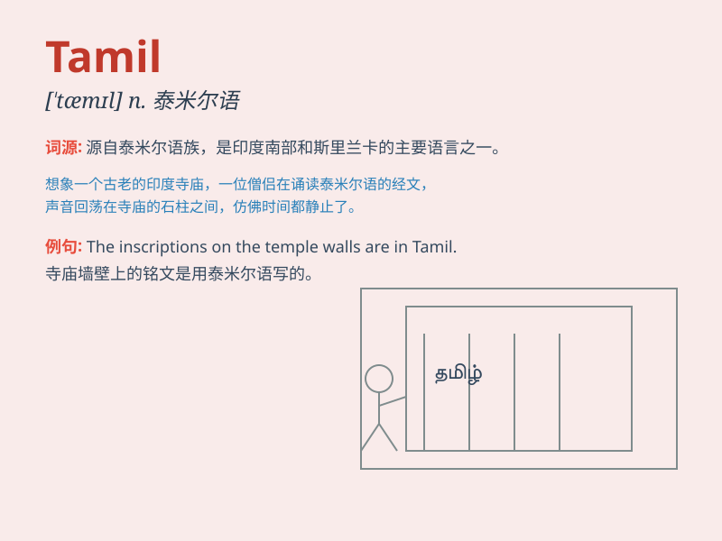

## Tamil

**英音:** _[ˈtæmɪl]_ **美音:** _[ˈtɑːmɪl]_

**译义:** *n.
泰米尔语（印度南部和斯里兰卡的一种语言）；泰米尔人（印度南部和斯里兰卡的一个民族）*

### 短语

+ **Tamil Nadu:** _泰米尔纳德邦（印度南部的一个邦）_

+ **Tamil language:** _泰米尔语_

+ **Tamil film:** _泰米尔电影_

+ **Tamil literature:** _泰米尔文学_

+ **Tamil culture:** _泰米尔文化_

### 例句

#### 例句1

> **Tamil is one of the official languages of Sri Lanka.**

**中文翻译:** 泰米尔语是斯里兰卡的官方语言之一。

**单词释义:** 泰米尔语（一种语言）

#### 例句2

> **She is studying Tamil literature at the university.**

**中文翻译:** 她在大学里学习泰米尔文学。

**单词释义:** 泰米尔语（与文学相关）

#### 例句3

> **The Tamil community has its own unique traditions.**

**中文翻译:** 泰米尔族群有其自身独特的传统。

**单词释义:** 泰米尔（与族群相关）

### 背诵小故事

> A Tamil boy named Raj was passionate about his language. He would
teach others Tamil words every day. His love for Tamil made it easy for
everyone to remember the language.

**一个叫拉杰的泰米尔男孩对他的语言充满热情。他每天都会教别人泰米尔语单词。他对泰米尔语的热爱让大家很容易记住这种语言。**

### 图义

