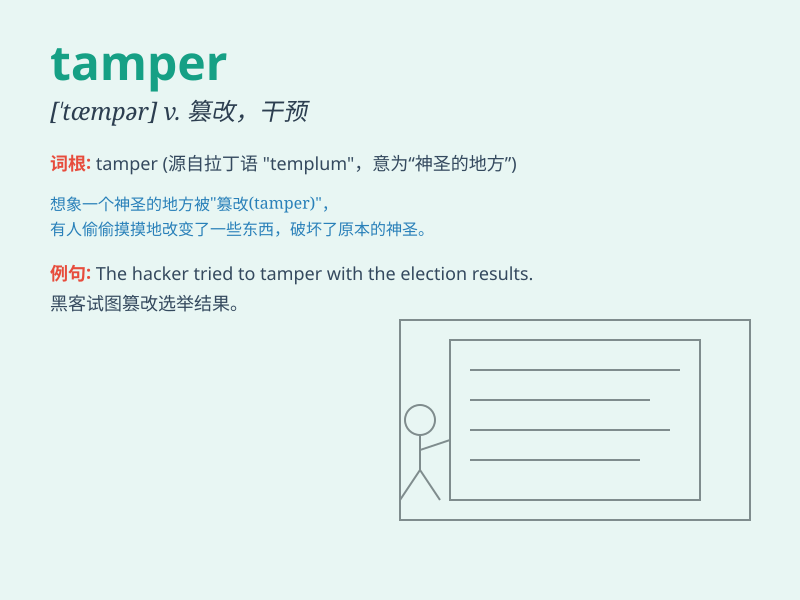

## tamper

**英音:** _[\'tæmpə]_ **美音:** _[\'tæmpɚ]_

**译义:**
*vi.干预,玩弄,贿赂,损害,削弱,篡改vt.篡改n.捣棒,夯,填塞者*

### 短语

+ **tamper with:** _干预；篡改；胡乱摆弄_

+ **tamper proof:** _防篡改的_

+ **tamper evidence:** _篡改证据_

+ **tamper detection:** _篡改检测_

+ **tamper alarm:** _篡改警报_

### 例句

#### 例句1

> **You should never tamper with the electrical equipment without
proper training.**

**中文翻译:** 没有经过适当的培训，你永远不应该乱动电气设备。

**单词释义:** 乱动；擅自摆弄

#### 例句2

> **The witness claimed that someone had tampered with the
evidence.**

**中文翻译:** 证人声称有人篡改了证据。

**单词释义:** 篡改；窜改

#### 例句3

> **He was caught tampering with the lock to try to break in.**

**中文翻译:** 他被抓到在撬锁试图闯入。

**单词释义:** 撬；拨弄

### 背诵小故事

> A curious monkey tampered with a locked box. It kept fiddling with
the lock, trying to open it. But tampering like this was naughty and
might cause trouble.

**一只好奇的猴子乱动一个锁着的盒子。它不停地摆弄锁，试图打开它。但像这样乱动是调皮的，可能会惹麻烦。**

### 图义

