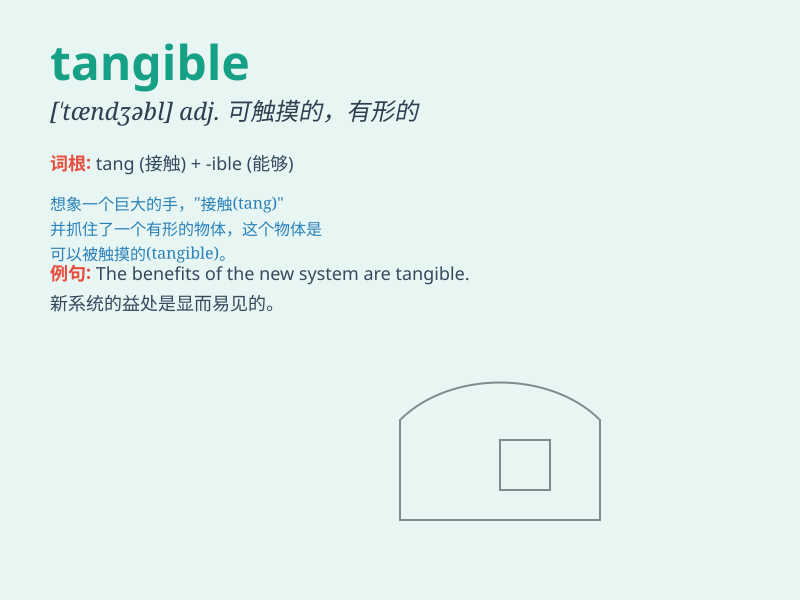

## tangible

**英音:** _[\'tæn(d)ʒɪb(ə)l]_ **美音:** _[\'tændʒəbl]_

**译义:** *adj.切实的*

### 短语

+ **tangible asset:** _有形资产_

+ **tangible benefit:** _切实利益；有形利益_

+ **tangible evidence:** _有形证据；确凿证据_

+ **tangible progress:** _切实的进展；有形的进展_

+ **tangible result:** _切实的结果；有形的结果_

### 例句

#### 例句1

> **The success of the project brought tangible benefits to the
community.**

**中文翻译:** 这个项目的成功给社区带来了切实的好处。

**单词释义:** 切实的；有形的

#### 例句2

> **We need tangible evidence to support our claim.**

**中文翻译:** 我们需要有形的证据来支持我们的主张。

**单词释义:** 有形的；实际的

#### 例句3

> **The improvement in her grades was a tangible result of her hard
work.**

**中文翻译:** 她成绩的提高是她努力学习的一个切实成果。

**单词释义:** 切实的；明确的

### 背诵小故事

> A thief broke into a house but could only find tangible items like
jewels and cash. He ignored intangible things like love letters.
Tangible means something that can be touched or felt physically.

**一个小偷闯进一所房子，但只能找到像珠宝和现金这样有形的东西。他忽略了像情书这样无形的东西。tangible
意思是可触摸或实际感觉到的有形的东西。**

### 图义

