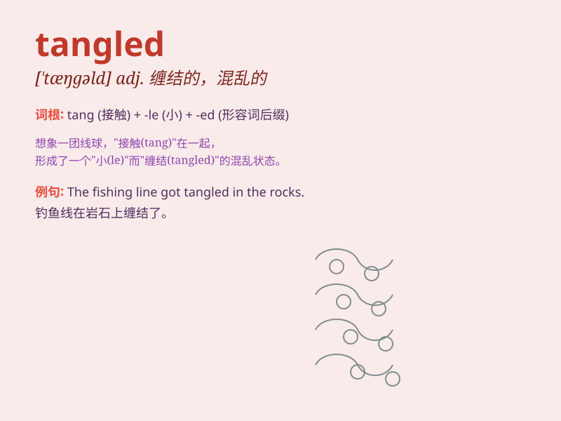

## tangled

**英音:** _[ˈtæŋɡld]_ **美音:** _[ˈtæŋɡld]_

**译义:** *adj.纠缠的；混乱的；缠结在一起的*

### 短语

+ **tangled web:** _错综复杂的网；复杂的局面_

+ **tangled hair:** _缠结的头发_

+ **tangled jungle:** _纠结缠绕的丛林_

+ **tangled relationship:** _复杂纠结的关系_

+ **tangled roots:** _缠绕的根_

### 例句

#### 例句1

> **Her hair was tangled after the windstorm.**

**中文翻译:** 在风暴过后，她的头发缠结在一起了。

**单词释义:** 缠结的；混乱的

#### 例句2

> **The wires were all tangled up in a knot.**

**中文翻译:** 这些电线全都缠结成了一个结。

**单词释义:** 缠结的；混乱的

#### 例句3

> **The story became tangled and hard to follow.**

**中文翻译:** 这个故事变得错综复杂，难以理解。

**单词释义:** 错综复杂的

### 背诵小故事

> Once upon a time, a little girl got lost in a forest. The branches
and vines were all tangled. She struggled to find her way out. Finally,
with great effort, she escaped the tangled mess.

**从前，一个小女孩在森林里迷路了。树枝和藤蔓都缠结在一起。她努力寻找出路。最后，经过巨大的努力，她逃出了这缠结的困境。**

### 图义

