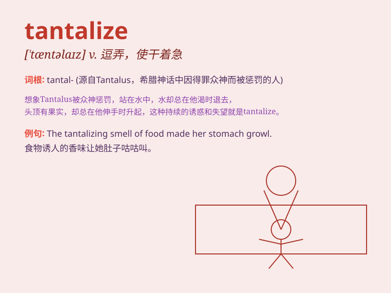

## tantalize

**英音:** _[ˈtæntəlaɪz]_ **美音:** _[ˈtæntəlaɪz]_

**译义:** *vt.逗弄,使干着急*

### 短语

+ **tantalize the taste buds:** _刺激味蕾_

+ **tantalize with promises:** _用承诺逗引_

+ **tantalize the imagination:** _激发想象力_

+ **tantalize constantly:** _不断逗弄_

+ **tantalize by showing:** _通过展示来诱惑_

### 例句

#### 例句1

> **The smell of the freshly baked cookies tantalized my taste
buds.**

**中文翻译:** 新鲜出炉的饼干的香味刺激着我的味蕾。

**单词释义:** 刺激；逗引

#### 例句2

> **The promise of a vacation tantalized her during the busy
workdays.**

**中文翻译:** 在繁忙的工作日里，度假的承诺让她心驰神往。

**单词释义:** 使向往；使着急

#### 例句3

> **The new video game tantalized the kids with its exciting
features.**

**中文翻译:** 新的电子游戏因其令人兴奋的特色而让孩子们迫不及待。

**单词释义:** 逗弄；使干着急

### 背诵小故事

> A hungry man was tantalized by the smell of delicious food from a
closed restaurant. He could smell it but couldn\'t get in to eat. Just
like how tantalize means to tease or torment by offering something
desirable but keeping it out of reach.

**一个饥饿的人被一家关门的餐馆里飘出的美食香气所诱惑。他能闻到却进不去吃。这就像\'tantalize\'这个词的意思，通过提供令人向往的东西却不让得到来逗弄或折磨。**

### 图义

