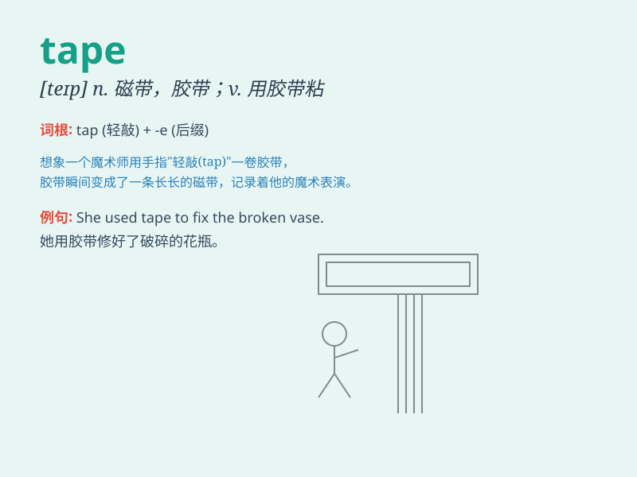

## tape

**英音:** _[teɪp]_ **美音:** _[tep]_

**译义:** *n.带子,带,录音带,磁带vt.录音*

### 短语

+ **tape recorder:** _磁带录音机_

+ **video tape:** _录像带_

+ **adhesive tape:** _胶带；黏胶带_

+ **tape measure:** _卷尺；皮尺_

+ **masking tape:** _遮蔽胶带；美纹纸胶带_

### 例句

#### 例句1

> **I need to tape this box shut.**

**中文翻译:** 我需要用胶带把这个盒子封起来。

**单词释义:** 用胶带粘贴

#### 例句2

> **The athlete was taping his ankle before the game.**

**中文翻译:** 这位运动员在比赛前正在包扎他的脚踝。

**单词释义:** 包扎；用绷带包扎

#### 例句3

> **She recorded the song on tape.**

**中文翻译:** 她把这首歌录在磁带上。

**单词释义:** 磁带

### 背诵小故事

> I needed to pack a box. But I couldn\'t find any rope. Then I
remembered I had some tape. With the tape, I sealed the box tightly. It
was a great help!

**我需要打包一个箱子。但我找不到任何绳子。然后我想起我有一些胶带。用胶带，我把箱子紧紧地封好了。它帮了大忙！**

### 图义

