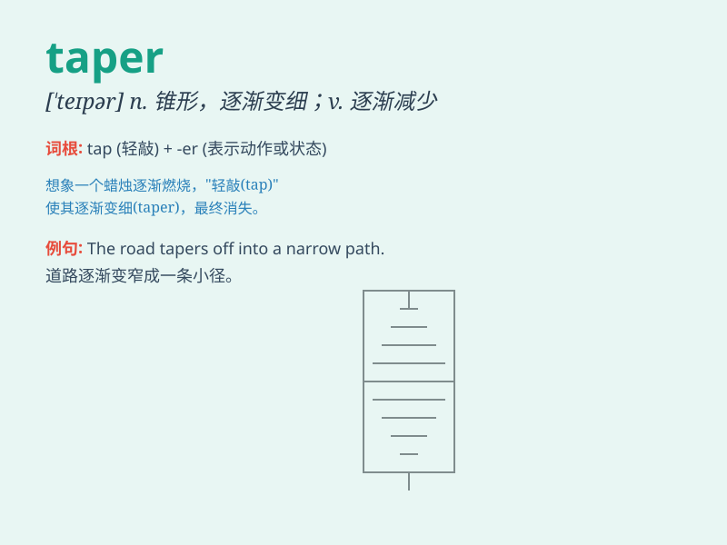

## taper

**英音:** _[\'teɪpə]_ **美音:** _[\'tepɚ]_

**译义:** *n.锥形,锥度v.逐渐变细,逐渐减少*

### 短语

+ **taper off:** _逐渐减少；逐渐变细；逐渐停止_

+ **taper to:** _逐渐变细至；逐渐缩小到_

+ **taper down:** _逐渐减少；逐渐降低_

+ **taper out:** _逐渐消失；逐渐结束_

+ **taper candle:** _锥形蜡烛_

### 例句

#### 例句1

> **The candles tapered to a point.**

**中文翻译:** 蜡烛逐渐变细成一个尖头。

**单词释义:** 逐渐变细

#### 例句2

> **He tapered his fingers.**

**中文翻译:** 他把手指逐渐变细。

**单词释义:** 使逐渐变细

#### 例句3

> **The economic growth tapered off in the second half of the
year.**

**中文翻译:** 经济增长在下半年逐渐放缓。

**单词释义:** 逐渐减少；逐渐变弱

### 背诵小故事

> A prince needed a special taper for the magic lantern. But the taper
was too thick at first. So, a skilled artisan carefully made it thinner
and thinner until it was just right. That\'s how we remember \'taper\'
means to become gradually narrower.

**一位王子需要一根特殊的细蜡烛用于魔法灯笼。但这根蜡烛起初太粗了。于是，一位熟练的工匠仔细地将其做得越来越细，直到恰到好处。这就是我们记住'taper'表示逐渐变窄的方法。**

### 图义

