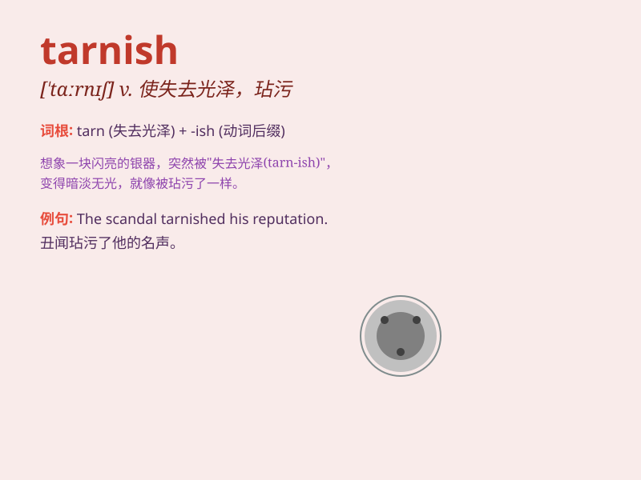

## tarnish

**英音:** _[\'tɑːnɪʃ]_ **美音:** _[\'tɑrnɪʃ]_

**译义:** *v.失去光泽*

### 短语

+ **tarnish reputation:** _损害声誉_

+ **tarnish image:** _玷污形象_

+ **tarnish metal:** _使金属失去光泽_

+ **tarnish surface:** _使表面失去光泽_

+ **tarnish memory:** _玷污记忆_

### 例句

#### 例句1

> **The silverware tarnished over time.**

**中文翻译:** 这些银器随着时间的推移失去了光泽。

**单词释义:** 失去光泽；变暗

#### 例句2

> **His reputation was tarnished by the scandal.**

**中文翻译:** 他的声誉因这起丑闻而受损。

**单词释义:** 损害；玷污

#### 例句3

> **The copper tarnishes easily in a humid environment.**

**中文翻译:** 铜在潮湿的环境中很容易失去光泽。

**单词释义:** （使）失去光泽

### 背诵小故事

> A shiny silver coin was left in a damp cave. Over time, the moisture
made the coin lose its luster and become tarnished. Just like that,
tarnish means to lose shine or become less bright and attractive.

**一枚闪亮的银币被留在潮湿的洞穴里。随着时间的推移，潮气使银币失去了光泽，变得晦暗了。就像这样，tarnish
意思是失去光泽或变得不那么明亮和吸引人。**

### 图义

