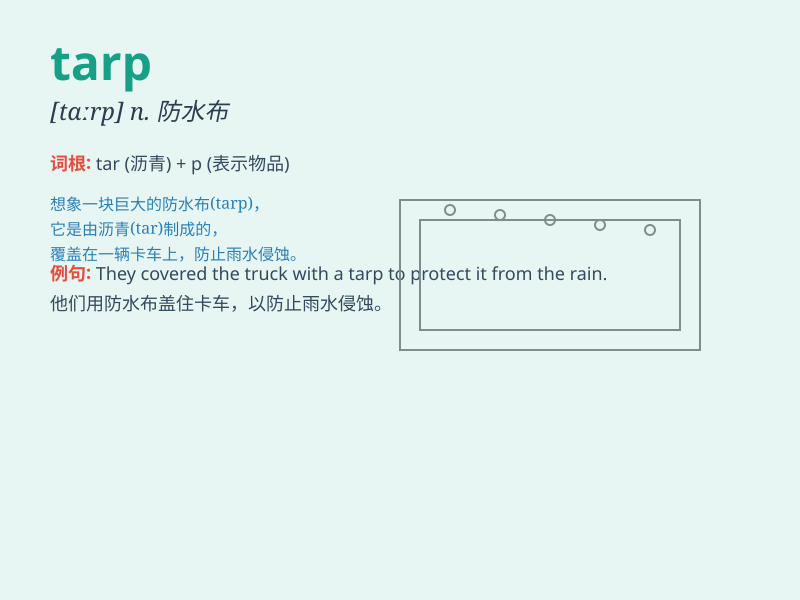

## tarp

**英音:** _[tɑːp]_ **美音:** _[tɑrp]_

**译义:** *n.(=tarpaulin)防水布,油布*

### 短语

+ **tarp shelter:** _防水布遮蔽所_

+ **blue tarp:** _蓝色防水布_

+ **tarp cover:** _防水布覆盖物_

+ **heavy-duty tarp:** _耐用的防水布_

+ **tarp tent:** _防水布帐篷_

### 例句

#### 例句1

> **He covered the boat with a tarp to protect it from the rain.**

**中文翻译:** 他用一块防水布盖住了船以保护它免受雨淋。

**单词释义:** 防水布；油布

#### 例句2

> **The workers used a tarp to cover the construction materials.**

**中文翻译:** 工人们用一块防水布盖住建筑材料。

**单词释义:** 防水布；油布

#### 例句3

> **She spread the tarp on the ground for a picnic.**

**中文翻译:** 她把防水布铺在地上准备野餐。

**单词释义:** 防水布；油布

### 背诵小故事

> A man was camping in the forest. Suddenly, it started raining.
Luckily, he had a tarp to cover himself and his tent. The tarp protected
him from getting wet.

**一个男人在森林里露营。突然，开始下雨了。幸运的是，他有一块防水布来遮盖自己和帐篷。这块防水布保护他不被淋湿。**

### 图义

