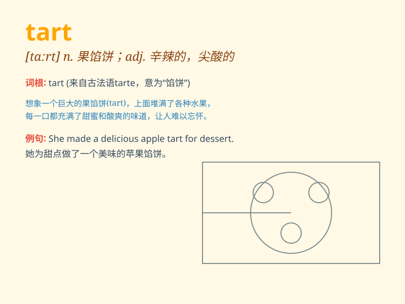

## tart

**英音:** _[tɑːt]_ **美音:** _[tɑrt]_

**译义:**
*adj.酸的,辛辣的,尖酸的,刻薄的vt.打扮n.果馅饼,小烘饼,妓女*

### 短语

+ **apple tart:** _苹果馅饼_

+ **tart up:** _打扮得花枝招展；把...装饰得俗艳_

+ **lemon tart:** _柠檬馅饼_

+ **fruit tart:** _水果馅饼_

+ **tart reply:** _尖刻的回答_

### 例句

#### 例句1

> **The fruit tart looked delicious and inviting.**

**中文翻译:** 这个水果馅饼看起来美味诱人。

**单词释义:** 馅饼；果馅饼

#### 例句2

> **Her remarks were rather tart and hurtful.**

**中文翻译:** 她的话相当尖刻伤人。

**单词释义:** 尖酸的；刻薄的

#### 例句3

> **The air had a tart smell of vinegar.**

**中文翻译:** 空气中有一股浓烈的醋味。

**单词释义:** 浓烈的；刺鼻的

### 背诵小故事

> A princess was attending a grand party. But the dessert served was a
tart that was too sweet. She took a bite and made a funny face.
Remember, \'tart\' is this sweet pastry.

**一位公主正在参加一个盛大的聚会。但是提供的甜点是一个太甜的果馅饼。她咬了一口，做了个滑稽的表情。记住，\'tart\'就是这种甜馅饼。**

### 图义

