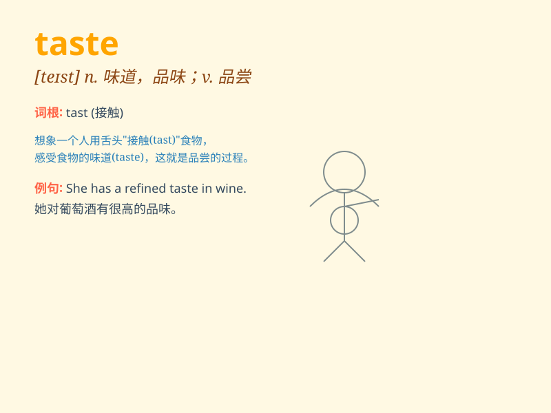

## taste

**英音:** _[teɪst]_ **美音:** _[test]_

**译义:** *v.品尝,辨味,(of)有
\...味道,领略vt.体验,感到n.味道,味觉*

### 短语

+ **taste good:** _尝起来好；味道好_

+ **taste bad:** _尝起来不好；味道差_

+ **taste of:** _有...味道；体验到_

+ **in good taste:** _得体；高雅_

+ **in bad taste:** _粗俗；不得体_

### 例句

#### 例句1

> **The soup tastes delicious.**

**中文翻译:** 这汤尝起来很美味。

**单词释义:** 尝起来；有......的味道

#### 例句2

> **She has a taste for classical music.**

**中文翻译:** 她对古典音乐有兴趣。

**单词释义:** 爱好；兴趣

#### 例句3

> **I want to taste the local food when I travel.**

**中文翻译:** 我旅行时想品尝当地的食物。

**单词释义:** 品尝

### 背诵小故事

> One day, Tom had a piece of cake. The moment he put it in his mouth,
he knew it was delicious. This feeling when he experienced the flavor
was called \'taste\'.

**一天，汤姆吃了一块蛋糕。当他把蛋糕放进嘴里的那一刻，他就知道它很美味。他体验这种味道时的这种感觉就叫做'taste'。**

### 图义

