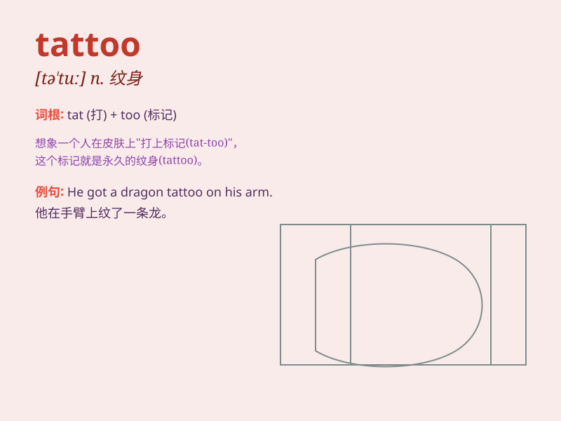

## tattoo

**英音:** _[tæ\'tuː]_ **美音:** _[tæ\'tu]_

**译义:** *v.刺花样n.纹身*

### 短语

+ **tattoo parlor:** _纹身店_

+ **tattoo artist:** _纹身艺术家_

+ **get a tattoo:** _纹身；刺青_

+ **tattoo needle:** _纹身针_

+ **tattoo design:** _纹身设计_

### 例句

#### 例句1

> **She got a beautiful tattoo of a flower on her ankle.**

**中文翻译:** 她在脚踝处纹了一朵漂亮的花的纹身。

**单词释义:** 纹身；刺青

#### 例句2

> **The sailor\'s tattoos told stories of his adventures at sea.**

**中文翻译:** 这位水手的纹身讲述了他在海上的冒险故事。

**单词释义:** 纹身图案

#### 例句3

> **The tribe has a tradition of tattooing their faces for special
ceremonies.**

**中文翻译:** 这个部落有在特殊仪式上在脸上纹身的传统。

**单词释义:** 给......纹身；在......上刺青

### 背诵小故事

> One day, a brave adventurer went to a faraway island. There, he saw
the local people had beautiful tattoos on their bodies. These tattoos
were not just decorations but told stories of their bravery and
experiences. The adventurer was deeply impressed by the tattoos.

**有一天，一位勇敢的冒险家去了一个遥远的岛屿。在那里，他看到当地人身上有漂亮的纹身。这些纹身不仅仅是装饰，还讲述了他们的勇敢和经历。冒险家对这些纹身印象深刻。**

### 图义

