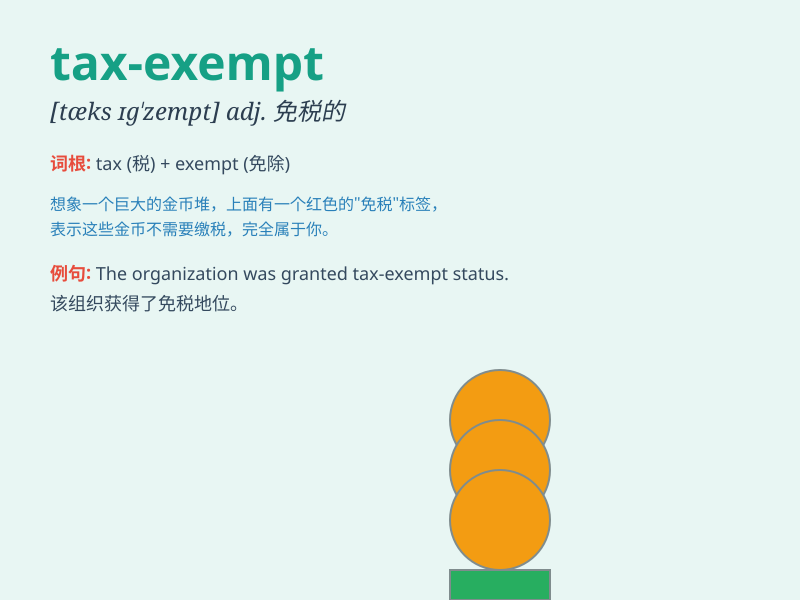

## tax-exempt

**英音:** _[tæksˈɛksɛmp(t)]_ **美音:** _[tæksˈɛksempt]_

**译义:** *形容词，表示免税的，免于缴税的*

### 短语

+ **tax-exempt income:** _免税收入_

+ **tax-exempt organization:** _免税组织_

+ **tax-exempt bond:** _免税债券_

+ **tax-exempt status:** _免税地位_

+ **tax-exempt property:** _免税财产_

### 例句

#### 例句1

> **The charity is tax-exempt, allowing it to focus more resources on
helping those in need.**

**中文翻译:**
这个慈善机构是免税的，这使它能够将更多的资源集中用于帮助那些有需要的人。

**单词释义:** 免税的

#### 例句2

> **Some educational institutions are tax-exempt to promote learning
and research.**

**中文翻译:** 一些教育机构是免税的，以促进学习和研究。

**单词释义:** 免税的

#### 例句3

> **The new law aims to clarify which organizations are tax-exempt
and under what conditions.**

**中文翻译:** 新法律旨在明确哪些组织是免税的以及在什么条件下免税。

**单词释义:** 免税的

### 背诵小故事

> A poor artist was struggling to make a living. One day, he received a
special certificate that made his artworks tax-exempt. This allowed him
to sell his creations at lower prices and finally gain success.

**一位贫困的艺术家一直在为生计苦苦挣扎。有一天，他收到了一份特殊证书，使他的艺术作品免税。这让他能够以更低的价格出售自己的创作，最终获得成功。**

### 图义

