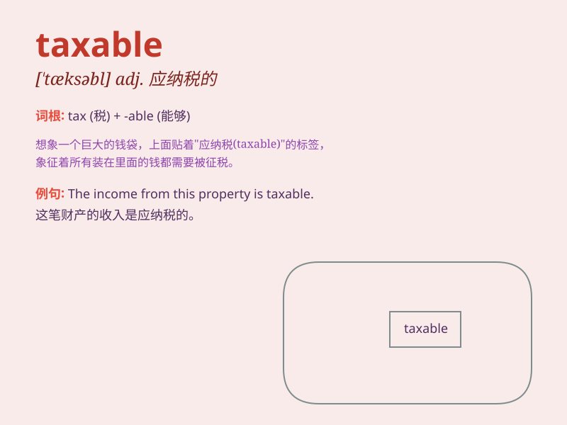

## taxable

**英音:** _[ˈtæksəbl]_ **美音:** _[ˈtæksəbl]_

**译义:** *adj.应征税的*

### 短语

+ **taxable income:** _应纳税所得额_

+ **taxable goods:** _应税货物_

+ **taxable services:** _应税服务_

+ **taxable transaction:** _应税交易_

+ **taxable property:** _应税财产_

### 例句

#### 例句1

> **Income from certain investments is taxable.**

**中文翻译:** 某些投资所得的收入是应纳税的。

**单词释义:** 应纳税的

#### 例句2

> **The gift may be taxable depending on its value.**

**中文翻译:** 这份礼物根据其价值可能需要纳税。

**单词释义:** 应纳税的

#### 例句3

> **Property sales can result in taxable gains.**

**中文翻译:** 房产销售可能会产生应纳税的收益。

**单词释义:** 应纳税的

### 背诵小故事

> A man was very worried because his income became taxable. But he
learned to manage his finances carefully and finally dealt with the tax
issue smoothly.

**一个男人非常担心，因为他的收入要纳税了。但他学会了仔细管理自己的财务，最终顺利解决了税收问题。**

### 图义

