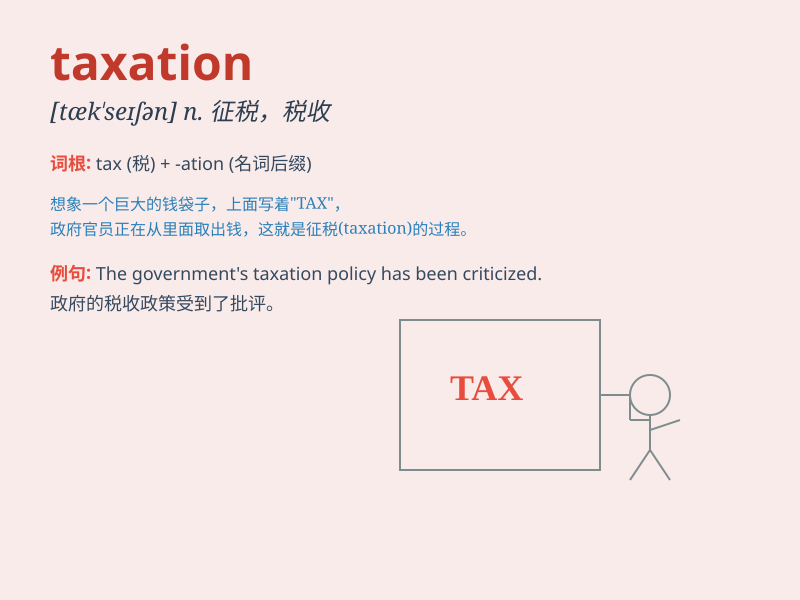

## taxation

**英音:** _[tæk\'seɪʃ(ə)n]_ **美音:** _[tæk\'seʃən]_

**译义:** *n.课税,征税,抽税,税款,估定的税额*

### 短语

+ **income taxation:** _所得税_

+ **taxation policy:** _税收政策_

+ **taxation system:** _税收制度_

+ **corporate taxation:** _公司税_

+ **property taxation:** _财产税_

### 例句

#### 例句1

> **The government is considering reforms to the taxation system.**

**中文翻译:** 政府正在考虑对税收制度进行改革。

**单词释义:** 税收；征税

#### 例句2

> **High taxation can have a negative impact on economic growth.**

**中文翻译:** 高税收可能对经济增长产生负面影响。

**单词释义:** 税收；课税

#### 例句3

> **She has expertise in taxation law.**

**中文翻译:** 她在税法方面有专长。

**单词释义:** 税收；征税制度

### 背诵小故事

> A poor man was always worried about taxation. One day, he dreamt of a
fairy who told him that if he worked hard and saved money, the burden of
taxation would be less. When he woke up, he was determined to change.

**一个穷人总是为税收而担忧。有一天，他梦到一个仙女告诉他，如果努力工作并省钱，税收的负担就会减轻。当他醒来，他决心改变。**

### 图义

