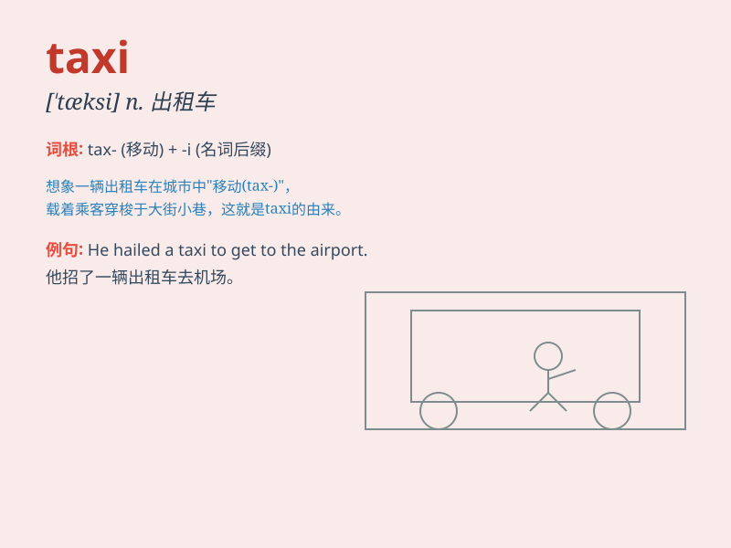

## taxi

**英音:** _[\'tæksɪ]_ **美音:** _[\'tæksi]_

**译义:** *n.出租汽车v.乘坐出租汽车*

### 短语

+ **take a taxi:** _乘坐出租车_

+ **call a taxi:** _叫出租车_

+ **taxi stand:** _出租车招呼站；出租车候车处_

+ **taxi driver:** _出租车司机_

+ **taxi fare:** _出租车费_

### 例句

#### 例句1

> **I took a taxi to the airport.**

**中文翻译:** 我乘出租车去机场。

**单词释义:** 出租车

#### 例句2

> **The taxi driver was very friendly.**

**中文翻译:** 这位出租车司机非常友好。

**单词释义:** 出租车

#### 例句3

> **She hailed a taxi on the street.**

**中文翻译:** 她在街上叫了一辆出租车。

**单词释义:** 出租车

### 背诵小故事

> One day, I was in a hurry to catch a train. I hailed a taxi and
quickly got in. The taxi driver skillfully maneuvered through the
traffic and got me to the station on time. A taxi is a vehicle that
provides transportation service for a fee.

**有一天，我急着赶火车。我叫了一辆出租车然后迅速上车。出租车司机熟练地在车流中穿梭，准时把我送到了车站。出租车是一种收费提供运输服务的车辆。**

### 图义

