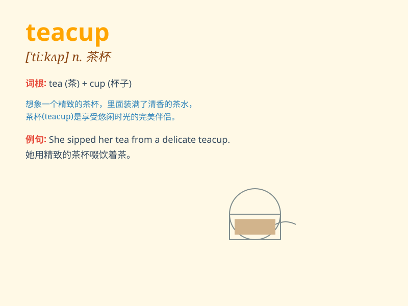

## teacup

**英音:** _[\'tiːkʌp]_ **美音:** _[ˈtiˌkʌp]_

**译义:** *n.茶杯,一茶杯容量*

### 短语

+ **a fine teacup:** _一个精致的茶杯_

+ **break a teacup:** _打碎一个茶杯_

+ **decorative teacup:** _装饰性的茶杯_

+ **empty teacup:** _空茶杯_

+ **handle of a teacup:** _茶杯的把手_

### 例句

#### 例句1

> **She carefully held the delicate teacup.**

**中文翻译:** 她小心翼翼地拿着那精致的茶杯。

**单词释义:** 茶杯

#### 例句2

> **The teacup on the table is painted with beautiful flowers.**

**中文翻译:** 桌子上的茶杯绘有美丽的花朵。

**单词释义:** 茶杯

#### 例句3

> **He broke the teacup by accident.**

**中文翻译:** 他不小心打碎了茶杯。

**单词释义:** 茶杯

### 背诵小故事

> One day, a little girl was having a tea party with her dolls. She
carefully picked up the beautiful teacup, filled it with warm tea, and
shared it with her friends. The teacup made the party so special.

**有一天，一个小女孩和她的玩偶们举行茶会。她小心翼翼地拿起漂亮的茶杯，装满了温热的茶，并和朋友们分享。这个茶杯让聚会变得特别。**

### 图义

