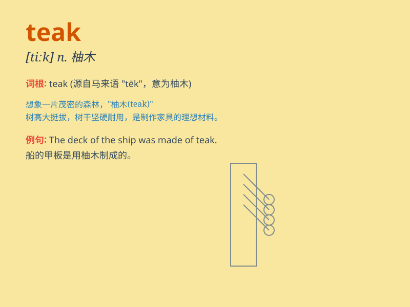

## teak

**英音:** _[tiːk]_ **美音:** _[tik]_

**译义:** *n.[植]柚木*

### 短语

+ **teak wood:** _柚木木材_

+ **teak furniture:** _柚木家具_

+ **teak tree:** _柚木树_

+ **teak deck:** _柚木甲板_

+ **solid teak:** _实心柚木_

### 例句

#### 例句1

> **The table is made of teak and it\'s very sturdy.**

**中文翻译:** 这张桌子是由柚木制成的，而且非常坚固。

**单词释义:** 柚木

#### 例句2

> **She bought a teak chair for her garden.**

**中文翻译:** 她为她的花园买了一把柚木椅子。

**单词释义:** 柚木

#### 例句3

> **The teak wood has a beautiful grain.**

**中文翻译:** 柚木有着美丽的纹理。

**单词释义:** 柚木

### 背诵小故事

> A man went to a forest and saw a huge tree. The guide told him it was
a teak tree. The wood of teak is very valuable and durable. He was
amazed by the beauty and strength of the teak.

**一个男人去了森林，看到一棵巨大的树。导游告诉他这是一棵柚木树。柚木的木材非常珍贵且耐用。他对柚木的美丽和坚固感到惊讶。**

### 图义

