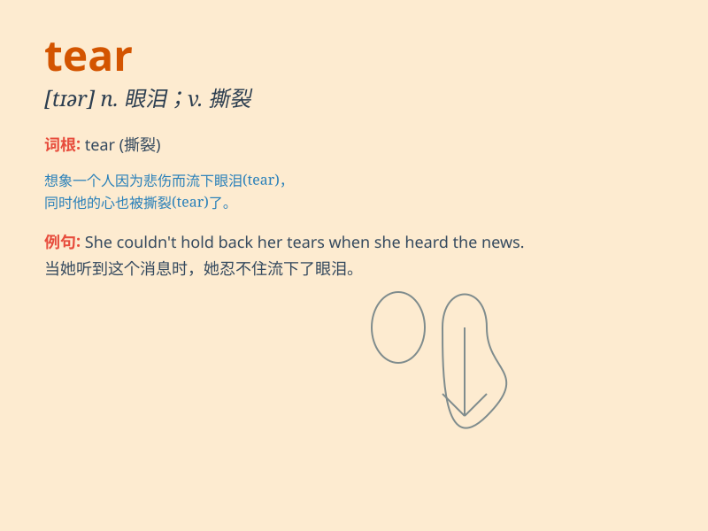

## tear

**英音:** _[(for v.) ˈtɛː; (for n.) ˈtɪə]_ **美音:**
_[(for v.) ˈter; (for n.) ˈtir]_

**译义:**
*n.破处,破缝,泪滴,眼泪,扯,飞奔,激怒vi.流泪,撕破,猛冲,飞奔,被撕破vt.扯,撕,撕破,戳破,拉掉,折磨,使分裂,撕掉*

### 短语

+ **tear apart:** _撕开；使分裂；使痛苦_

+ **tear down:** _拆毁；拆卸；诋毁_

+ **in tears:** _流着泪；含着泪_

+ **tear up:** _撕毁；撕碎；拔起_

+ **wear and tear:** _磨损；损耗_

### 例句

#### 例句1

> **She shed a tear when she heard the sad news.**

**中文翻译:** 当她听到这个悲伤的消息时，她流下了一滴眼泪。

**单词释义:** 眼泪

#### 例句2

> **Don\'t tear the paper; it\'s important.**

**中文翻译:** 别撕这张纸，它很重要。

**单词释义:** 撕；扯

#### 例句3

> **The strong wind tore the flag apart.**

**中文翻译:** 强风把旗子撕裂了。

**单词释义:** 撕裂；撕开

### 背诵小故事

> A little girl was very sad and started to cry. Tears rolled down her
cheeks. She tore a piece of paper in anger. Remember, \'tear\' can mean
the drops from eyes or to rip something.

**一个小女孩非常伤心并开始哭泣。泪水从她的脸颊滚落。她生气地撕了一张纸。记住，'tear'可以表示眼泪或者撕的动作。**

### 图义

