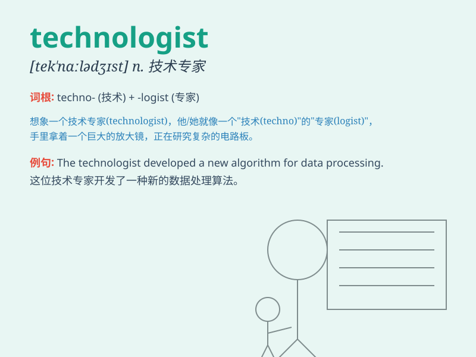

## technologist

**英音:** _[tekˈnɒlədʒɪst]_ **美音:** _[tekˈnɑːlədʒɪst]_

**译义:** *n.技术专家,工艺学家,工艺人员*

### 短语

+ **computer technologist:** _计算机技术专家_

+ **medical technologist:** _医学技术专家_

+ **senior technologist:** _高级技术专家_

+ **experienced technologist:** _经验丰富的技术专家_

+ **leading technologist:** _领先的技术专家_

### 例句

#### 例句1

> **The technologist is working on a revolutionary new software.**

**中文翻译:** 这位技术专家正在致力于一款革命性的新软件。

**单词释义:** 技术专家

#### 例句2

> **She is a renowned technologist in the field of artificial
intelligence.**

**中文翻译:** 她是人工智能领域著名的技术专家。

**单词释义:** 技术专家

#### 例句3

> **The company hired several top technologists to lead the research
project.**

**中文翻译:** 公司聘请了几位顶尖的技术专家来领导这个研究项目。

**单词释义:** 技术专家

### 背诵小故事

> A young technologist named Tom was passionate about solving technical
problems. One day, he invented a new device that changed the world. His
expertise made him a well-known technologist.

**一位名叫汤姆的年轻技术专家对解决技术问题充满热情。有一天，他发明了一种改变世界的新设备。他的专业知识使他成为了一位著名的技术专家。**

### 图义

