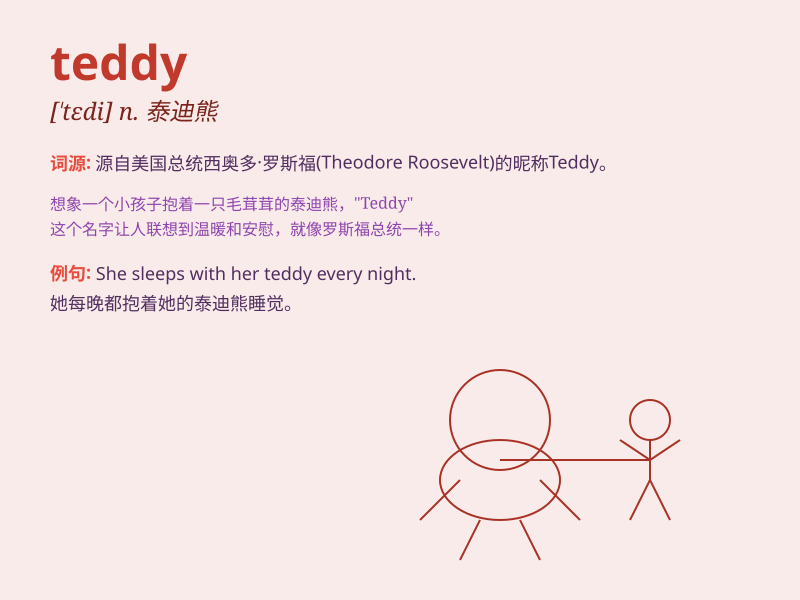

## teddy

**英音:** _[\'tedɪ]_ **美音:** _[\'tɛdi]_

**译义:** *n.(流行于20世纪20年代的妇女)连衫衬裤*

### 短语

+ **teddy bear:** _泰迪熊_

+ **teddy girl:** _穿着时髦的少女_

+ **teddy jacket:** _泰迪夹克_

+ **teddy boy:** _太保；不良少年_

+ **teddy coat:** _泰迪外套_

### 例句

#### 例句1

> **The little girl hugged her teddy tightly before going to
sleep.**

**中文翻译:** 小女孩在睡觉前紧紧地抱着她的泰迪熊。

**单词释义:** 泰迪熊

#### 例句2

> **He bought a teddy as a birthday present for his girlfriend.**

**中文翻译:** 他买了一只泰迪熊作为给他女朋友的生日礼物。

**单词释义:** 泰迪熊

#### 例句3

> **The teddy on the shelf looks so cute.**

**中文翻译:** 架子上的泰迪熊看起来很可爱。

**单词释义:** 泰迪熊

### 背诵小故事

> 有个小孩特别喜欢他的玩具熊，每天晚上都要抱着它睡觉，还亲切地叫它
teddy。有一天 teddy 不见了，小孩找了好久，最后在床底找到了，开心极了。

**有个小孩非常喜欢他的玩具熊，每天晚上都抱着它睡，还称呼它为
teddy。一天 teddy 不见了，小孩找了很久，最后在床底发现，小孩很开心。**

### 图义

