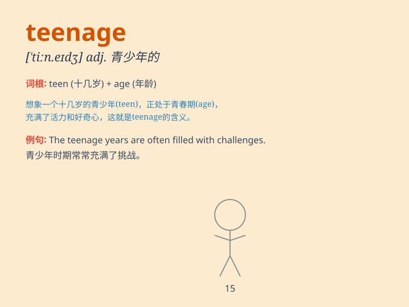

## teenage

**英音:** _[ˈtiːneɪdʒ]_ **美音:** _[ˈtiːneɪdʒ]_

**译义:** *adj.十几岁的*

### 短语

+ **teenage girl:** _十几岁的女孩_

+ **teenage boy:** _十几岁的男孩_

+ **teenage years:** _青少年时期_

+ **teenage rebellion:** _青少年叛逆_

+ **teenage angst:** _青少年的焦虑_

### 例句

#### 例句1

> **The teenage girl is very talented in music.**

**中文翻译:** 这个十几岁的女孩在音乐方面非常有天赋。

**单词释义:** 十几岁的（指 13 至 19 岁的）

#### 例句2

> **Teenage boys often have a lot of energy.**

**中文翻译:** 十几岁的男孩通常精力充沛。

**单词释义:** 十几岁的（指 13 至 19 岁的）

#### 例句3

> **She has a teenage son and a daughter.**

**中文翻译:** 她有一个十几岁的儿子和一个女儿。

**单词释义:** 十几岁的（指 13 至 19 岁的）

### 背诵小故事

> Once upon a time, there was a teenage girl. She was in that special
age between childhood and adulthood. She had dreams and challenges. This
word \'teenage\' describes her age full of possibilities and confusion.

**从前，有一个十几岁的女孩。她处于童年和成年之间的特殊年龄。她有梦想也有挑战。'teenage'这个词描述了她这个充满可能和困惑的年龄。**

### 图义

