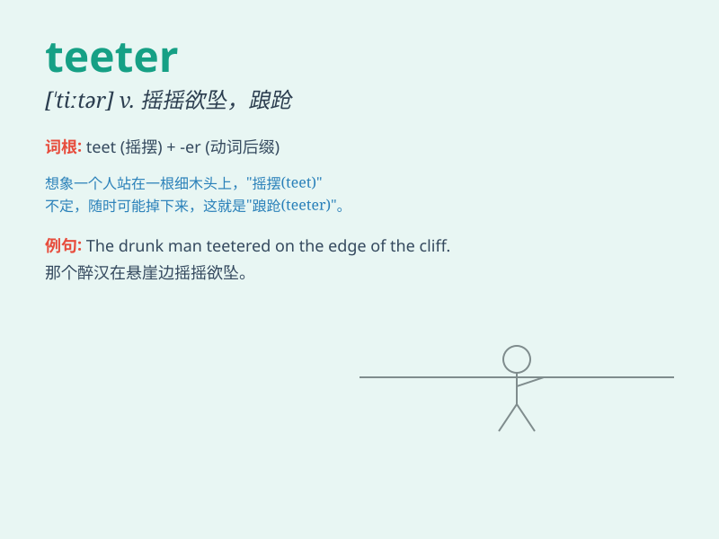

## teeter

**英音:** _[\'tiːtə]_ **美音:** _[\'titɚ]_

**译义:** *v.步履蹒跚,摇摇欲坠*

### 短语

+ **teeter on the brink:** _处于危险的边缘_

+ **teeter totter:** _跷跷板_

+ **teeter along:** _蹒跚而行_

+ **teeter between:** _在\...\...之间摇摆不定_

+ **teeter off:** _摇摇欲坠；蹒跚离开_

### 例句

#### 例句1

> **The child teetered on the edge of the chair.**

**中文翻译:** 这个孩子在椅子边上摇摇欲坠。

**单词释义:** 摇摇欲坠；蹒跚；踉跄

#### 例句2

> **The economy is teetering on the brink of recession.**

**中文翻译:** 经济在衰退的边缘摇摇欲坠。

**单词释义:** 摇摇欲坠；不稳定；处于险境

#### 例句3

> **She teetered along in her high heels.**

**中文翻译:** 她穿着高跟鞋摇摇晃晃地走着。

**单词释义:** 蹒跚；摇晃地走

### 背诵小故事

> A little bird was standing on a thin branch, teetering back and
forth. It looked like it might fall at any moment, but it managed to
keep its balance. \'Teeter\' means to sway unsteadily like that bird.

**一只小鸟站在一根细树枝上，前后摇晃着。它看起来随时可能掉下来，但它设法保持了平衡。'teeter'的意思就是像那只鸟一样不稳定地摇晃。**

### 图义

