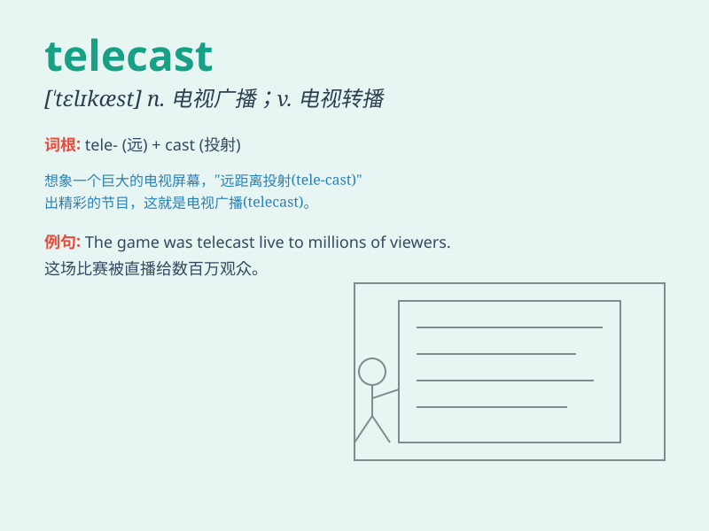

## telecast

**英音:** _[\'telɪkɑːst]_ **美音:** _[\'tɛlɪkæst]_

**译义:** *v.电视广播n.电视广播*

### 短语

+ **live telecast:** _现场直播_

+ **telecast program:** _电视广播节目_

+ **national telecast:** _全国性电视广播_

+ **prime-time telecast:** _黄金时段的电视广播_

+ **sports telecast:** _体育电视广播_

### 例句

#### 例句1

> **The football game was telecast live around the world.**

**中文翻译:** 这场足球比赛在全球进行了现场直播。

**单词释义:** 以电视广播

#### 例句2

> **The news telecast at 7 o\'clock covered the latest events.**

**中文翻译:** 七点的新闻广播报道了最新的事件。

**单词释义:** 电视广播

#### 例句3

> **They telecast a documentary about wild animals last night.**

**中文翻译:** 昨晚他们电视播放了一部关于野生动物的纪录片。

**单词释义:** 播放（电视节目）

### 背诵小故事

>
想象一下，在远古时代，人们通过神奇的'tele'（远程）魔法，将精彩的表演'cast'（投射）到远方，让不同地方的人都能看到，这就是'telecast'（电视广播）的神奇之处。

**想象人们通过远程魔法投射表演来理解电视广播这个单词**

### 图义

