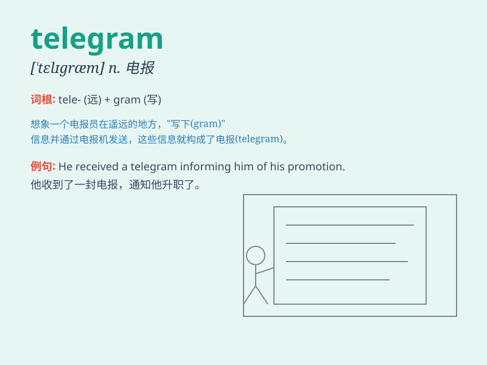

## telegram

**英音:** _[\'telɪgræm]_ **美音:** _[\'tɛlɪɡræm]_

**译义:** *n.电报*

### 短语

+ **send a telegram:** _发送一份电报_

+ **receive a telegram:** _收到一份电报_

+ **urgent telegram:** _紧急电报_

+ **coded telegram:** _加密电报_

+ **international telegram:** _国际电报_

### 例句

#### 例句1

> **I received a telegram from my friend saying she was coming to
visit.**

**中文翻译:** 我收到了朋友的一封电报，说她要来拜访。

**单词释义:** 电报

#### 例句2

> **The urgent telegram forced him to change his plans.**

**中文翻译:** 这封紧急电报迫使他改变计划。

**单词释义:** 电报

#### 例句3

> **She sent a telegram to her parents to tell them the good
news.**

**中文翻译:** 她给父母发了一封电报告诉他们这个好消息。

**单词释义:** 电报

### 背诵小故事

> One day, Tom was waiting anxiously for a telegram. Finally, the
postman delivered it. It was from his friend far away, telling him about
an exciting adventure. The telegram became the bridge of their
communication.

**有一天，汤姆焦急地等待着一封电报。最后，邮递员送来了它。这是来自远方朋友的，告诉他一个令人兴奋的冒险。这封电报成为了他们交流的桥梁。**

### 图义

