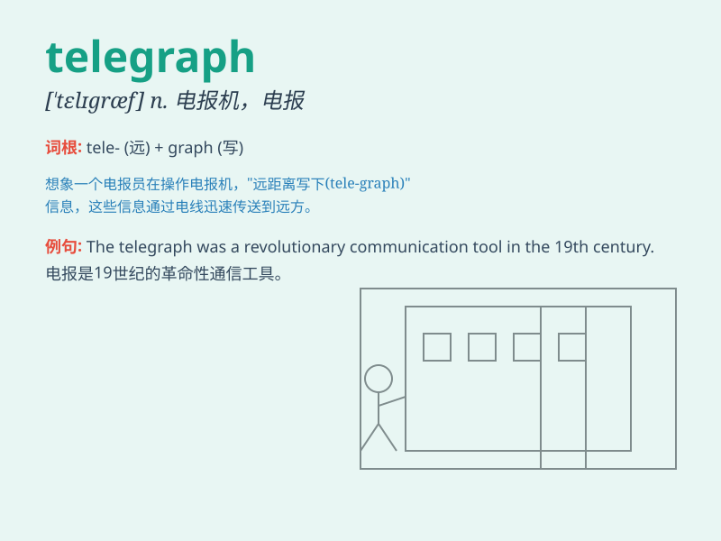

## telegraph

**英音:** _[\'telɪgrɑːf]_ **美音:** _[\'tɛlɪɡræf]_

**译义:** *n.电报机,电报v.打电报,发电报,打电报说*

### 短语

+ **telegraph pole:** _电线杆_

+ **telegraph wire:** _电报线_

+ **telegraph office:** _电报局_

+ **send a telegraph:** _发电报_

+ **receive a telegraph:** _收电报_

### 例句

#### 例句1

> **The news was telegraphed to all parts of the country.**

**中文翻译:** 这一消息已用电报发往全国各地。

**单词释义:** 用电报发送

#### 例句2

> **He telegraphed his congratulations.**

**中文翻译:** 他打电报祝贺。

**单词释义:** 打电报

#### 例句3

> **The decision was telegraphed to us.**

**中文翻译:** 这个决定已传达给我们。

**单词释义:** 传达

### 背诵小故事

> A long time ago, a man in a small town needed to send an urgent
message to his friend in a faraway place. He used the telegraph, which
sent electrical signals through wires, to communicate quickly. The
telegraph saved the day!

**很久以前，一个小镇上的男人需要给他在远方的朋友发送紧急消息。他使用了通过电线发送电信号的电报，从而快速地进行了交流。电报解决了问题！**

### 图义

