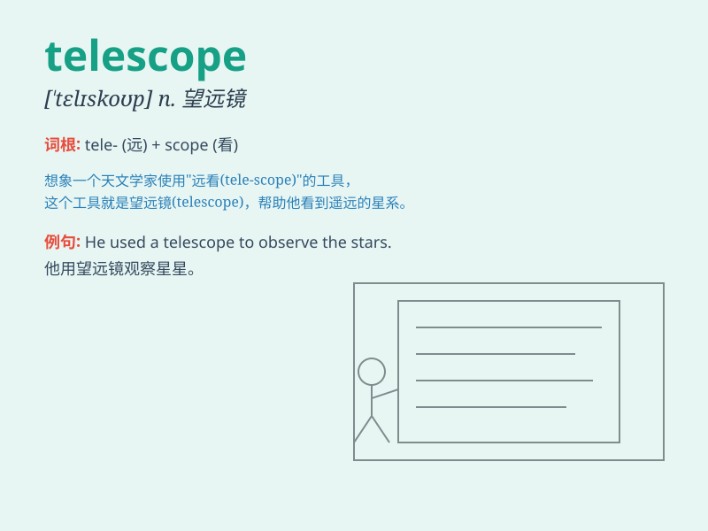

## telescope

**英音:** _[\'telɪskəʊp]_ **美音:** _[\'tɛləˌskop]_

**译义:** *n.望远镜v.压缩*

### 短语

+ **astronomical telescope:** _天文望远镜_

+ **refracting telescope:** _折射望远镜_

+ **reflecting telescope:** _反射望远镜_

+ **binocular telescope:** _双筒望远镜_

+ **telescope antenna:** _望远镜天线_

### 例句

#### 例句1

> **He pointed the telescope at the moon.**

**中文翻译:** 他把望远镜指向月亮。

**单词释义:** 望远镜

#### 例句2

> **The telescope enables us to see distant stars.**

**中文翻译:** 望远镜使我们能够看到遥远的星星。

**单词释义:** 望远镜

#### 例句3

> **She looked through the telescope and was amazed.**

**中文翻译:** 她通过望远镜观察，感到很惊讶。

**单词释义:** 望远镜

### 背诵小故事

> One day, a little boy was looking at the stars and wished he could
see them closer. Then, he found a telescope and through it, he could
view the distant stars clearly. The telescope made the faraway things
seem near.

**有一天，一个小男孩望着星星，希望能更近距离地看到它们。然后，他找到了一个望远镜，通过它，他能清晰地看到遥远的星星。望远镜让遥远的东西看起来很近。**

### 图义

