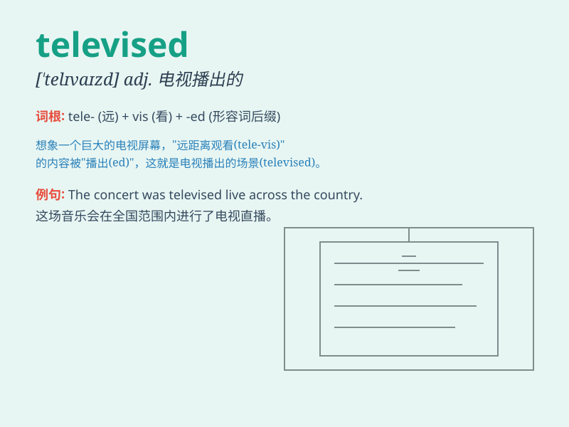

## televised

**英音:** _[ˈtelɪvaɪzd]_ **美音:** _[ˈtelɪˌvaɪzd]_

**译义:** *被电视转播的；通过电视传播的*

### 短语

+ **televised debate:** _电视辩论_

+ **televised interview:** _电视采访_

+ **televised speech:** _电视演讲_

+ **televised news:** _电视新闻_

+ **televised game show:** _电视游戏节目_

### 例句

#### 例句1

> **The football match was televised live around the world.**

**中文翻译:** 这场足球比赛在世界各地进行了现场直播。

**单词释义:** 通过电视播放

#### 例句2

> **The presidential debate will be televised on Friday night.**

**中文翻译:** 总统辩论将于周五晚上进行电视转播。

**单词释义:** 在电视上播出

#### 例句3

> **The concert was televised from the arena.**

**中文翻译:** 这场音乐会从竞技场进行了电视转播。

**单词释义:** 被电视转播

### 背诵小故事

> Imagine a world where a magic telescope could show events happening
far away. One day, this telescope started showing events on a big screen
for everyone to see. That\'s like what \'televised\' means -- events
shown through a special system for many to watch.

**想象一个世界，有一个神奇的望远镜能展示远方发生的事。有一天，这个望远镜开始在一个大屏幕上展示事件供大家观看。这就像'televised'的意思------通过特殊系统展示的事件以供很多人观看。**

### 图义

