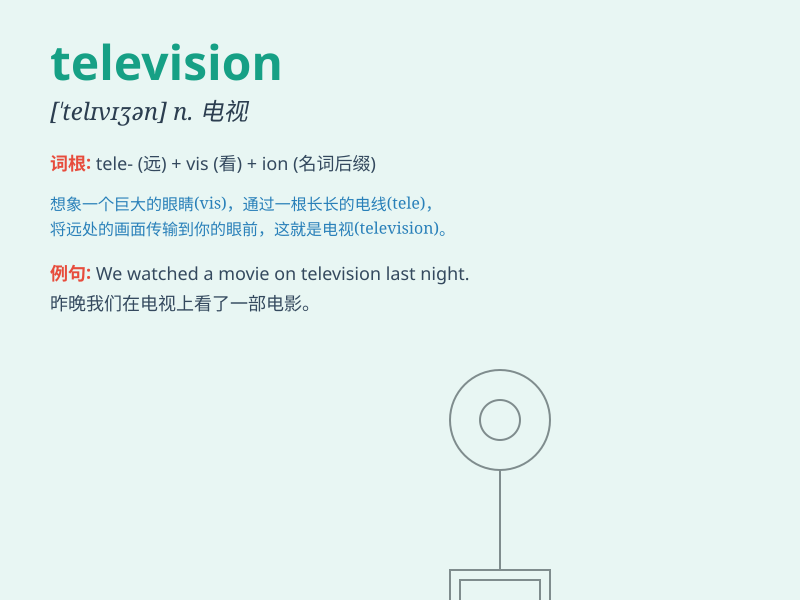

## television

**英音:** _[ˈtelɪvɪʒn]_ **美音:** _[tɛləˌvɪʒən]_

**译义:** *n.电视,电视机,电机学,电视广播事业*

### 短语

+ **watch television:** _看电视_

+ **color television:** _彩色电视_

+ **television set:** _电视机_

+ **cable television:** _有线电视_

+ **satellite television:** _卫星电视_

### 例句

#### 例句1

> **I like watching television in the evening.**

**中文翻译:** 我喜欢晚上看电视。

**单词释义:** 电视

#### 例句2

> **The television is too loud. Please turn it down.**

**中文翻译:** 电视声音太大。请把它调低。

**单词释义:** 电视

#### 例句3

> **There is a new television show that everyone is talking
about.**

**中文翻译:** 每个人都在谈论一个新的电视节目。

**单词释义:** 电视

### 背诵小故事

> A boy was very lonely at home. One day, a magic fairy appeared and
gave him a \'television\'. With it, he could see many wonderful things
and no longer felt alone. The television became his good friend.

**一个男孩独自在家非常孤独。有一天，一个神奇的仙女出现并给了他一台"电视机"。有了它，他能看到许多精彩的事物，不再感到孤单。电视机成了他的好朋友。**

### 图义

