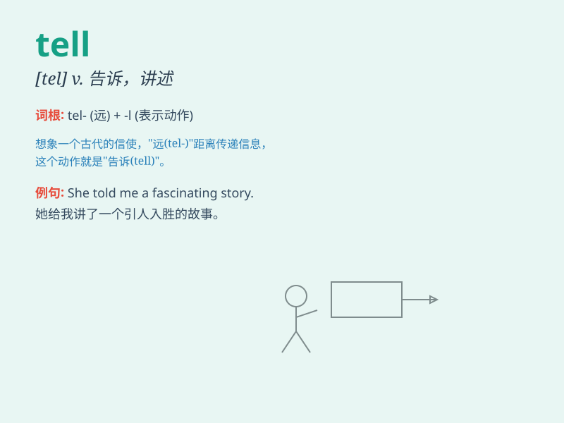

## tell

**英音:** _[tel]_ **美音:** _[tel]_

**译义:**
*vt.告诉,说,吩咐,断定,知道vi.讲述,泄密,告发,表明,作证n.\<方>讲的事,传闻*

### 短语

+ **tell apart:** _区分；辨别_

+ **tell off:** _斥责；责备_

+ **tell on:** _告发；产生（坏的）影响_

+ **tell the truth:** _说实话；讲真话_

+ **tell tales:** _搬弄是非；讲坏话_

### 例句

#### 例句1

> **She told me a secret.**

**中文翻译:** 她告诉了我一个秘密。

**单词释义:** 告诉

#### 例句2

> **Can you tell the difference between these two pictures?**

**中文翻译:** 你能看出这两张图片的区别吗？

**单词释义:** 分辨，辨别

#### 例句3

> **My watch tells the time accurately.**

**中文翻译:** 我的手表走时准确。

**单词释义:** 显示，表明

### 背诵小故事

> One day, Tom found a lost puppy. He decided to tell the owner about
it. He went to the nearby houses and finally found the worried owner.
The owner was so happy and thanked Tom. Tom felt great for telling the
truth.

**有一天，汤姆发现了一只走丢的小狗。他决定把这件事告诉狗的主人。他去了附近的房子，最终找到了忧心忡忡的主人。主人非常高兴并感谢了汤姆。汤姆因为讲出了实情而感觉很棒。**

### 图义

