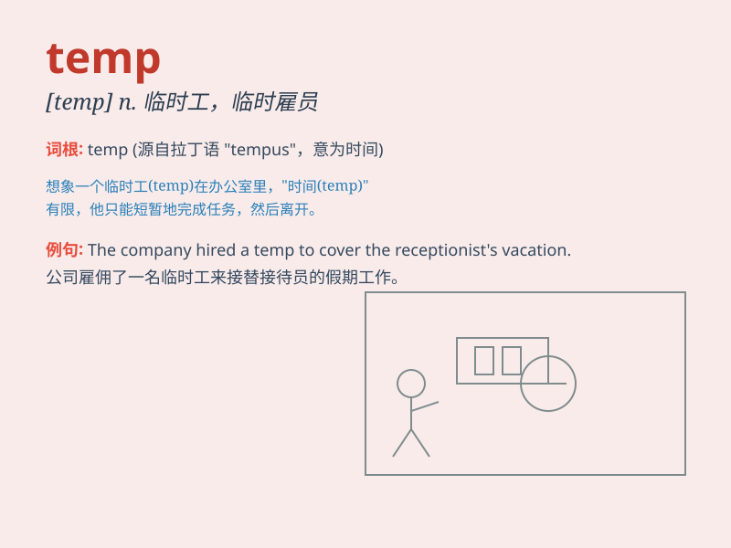

## temp

**英音:** _[temp]_ **美音:** _[temp]_

**译义:** *n.临时雇员；adj.临时的；v.暂时供给工作*

### 短语

+ **temp agency:** _临时职业介绍所_

+ **temp worker:** _临时工_

+ **temp job:** _临时工作_

+ **in temp:** _暂时；临时_

+ **temp position:** _临时职位_

### 例句

#### 例句1

> **I\'m working as a temp at the moment.**

**中文翻译:** 我目前在做临时工作。

**单词释义:** 临时的

#### 例句2

> **The company hired a temp to cover for the sick employee.**

**中文翻译:** 公司雇了一名临时工来顶替生病的员工。

**单词释义:** 临时雇员

#### 例句3

> **She took a temp job during her summer vacation.**

**中文翻译:** 她在暑假期间做了一份临时工作。

**单词释义:** 临时的

### 背诵小故事

> A person named Tom was looking for a job. He went to many companies
for interviews. But all were just temporary positions. He hoped to find
a stable one soon.

**一个叫汤姆的人正在找工作。他去了很多公司面试。但都是临时职位。他希望很快能找到一个稳定的工作。**

### 图义

