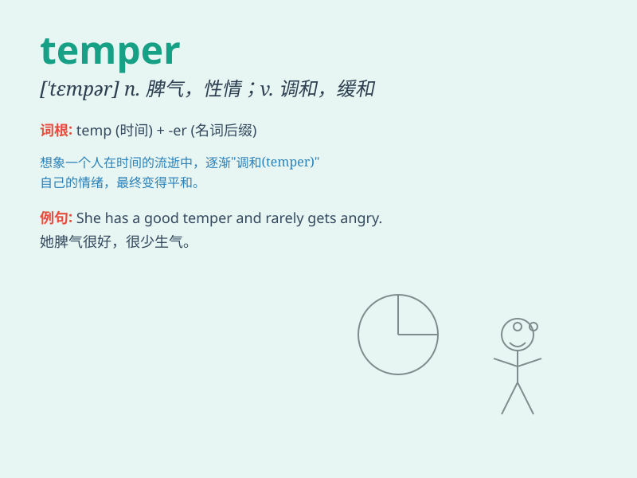

## temper

**英音:** _[\'tempə]_ **美音:** _[\'tɛmpɚ]_

**译义:**
*n.(钢等)韧度,回火,性情,脾气,情绪,心情,调剂,趋向v.(冶金)回火、锻炼,调和,调节*

### 短语

+ **bad temper:** _坏脾气_

+ **temper tantrum:** _发脾气；发怒_

+ **keep one\'s temper:** _忍住性子；不发脾气_

+ **lose one\'s temper:** _发脾气；发怒_

+ **in a temper:** _在生气；发脾气_

### 例句

#### 例句1

> **He has a quick temper and often loses his patience.**

**中文翻译:** 他脾气暴躁，经常失去耐心。

**单词释义:** 脾气

#### 例句2

> **The heat tempered the steel, making it stronger.**

**中文翻译:** 热量使钢材回火，使其变得更坚固。

**单词释义:** 锤炼；使回火

#### 例句3

> **She managed to temper her excitement when she heard the news.**

**中文翻译:** 当她听到这个消息时，她设法平复了激动的心情。

**单词释义:** 缓和；使适中

### 背诵小故事

> Once there was a blacksmith named Tom. His job was to temper the
steel to make it strong. But one day, he lost his temper when the fire
went out. So, \'temper\' can mean to make something tough or to be in a
bad mood.

**从前有个叫汤姆的铁匠。他的工作是锤炼钢铁使其坚固。但有一天，火灭了，他发脾气了。所以，'temper'可以指使某物坚韧或发脾气。**

### 图义

